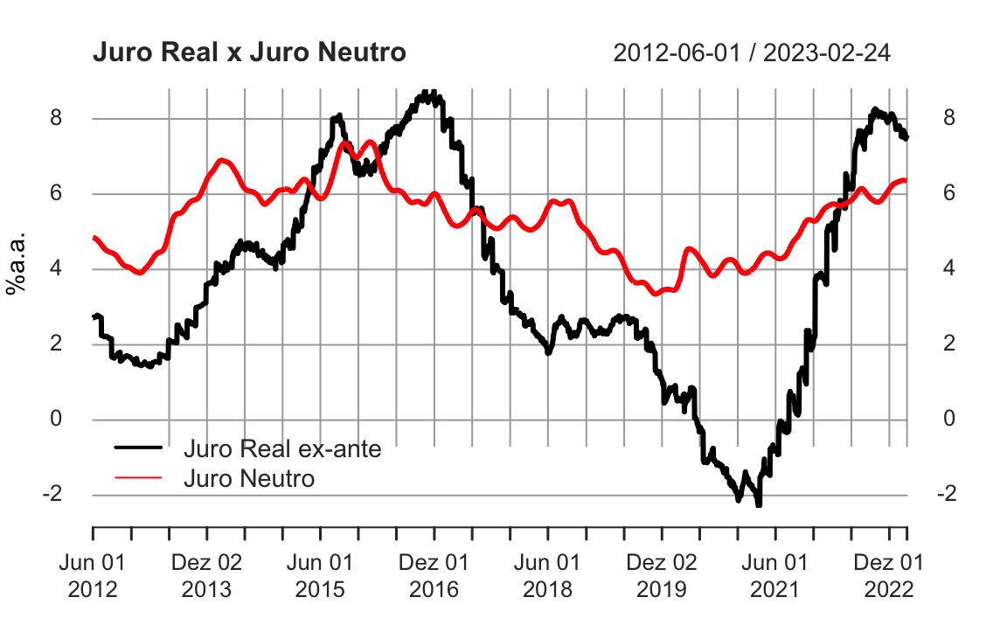

```{r mba0, include=FALSE}
setwd('/Users/jricardofl/Dropbox/tempecon/facape/mba2023')
#setwd("C:/Users/User client/Dropbox/tempecon/Facape/mba2023")

knitr::opts_chunk$set(
  echo       = TRUE,
  warning    = FALSE,
  message    = FALSE,
  comment    = NA,
  fig.width  = 10, 
  fig.height = 8,
  fig.align  = "center",
  comment    = "#",
  size       = "normalsize"
  )
```

<br>

# Fundamentos macroeconômicos para a Análise de Conjuntura

<br>

Segundo Robbins (2012), "Do ponto de vista do economista, as condições da existência humana exibem quatro características fundamentais. Os fins são vários. O tempo e os meios para obter esses fins são limitados e permitem aplicações alternativas. Ao mesmo tempo, os fins têm importâncias diferentes. Eis-nos aqui, criaturas conscientes com vários **desejos e aspirações**, com multidões de tendências instintivas, todas nos impelindo, de diferentes maneiras, a agir. O tempo em que essas tendências podem se expressar é **limitado**. O mundo exterior não oferece oportunidades completas para sua **total satisfação**. A vida é curta. A natureza é mesquinha. Nossos companheiros têm outros objetivos. Ainda assim nós podemos usar as nossas vidas para fazer coisas diferentes, podemos usar nossas ferramentas e os serviços de outros para **atingir diferentes objetivos**."

O ser humano faz, nesse contexto, escolhas todos os dias, reagindo a incentivos e restrições impostas pelo ambiente. De outra forma, **o ser humano, dotado de necessidades ilimitadas, escolhe o uso de recursos escassos entre fins alternativos**. Em microeconomia os economistas usam de cálculo diferencial e integral para analisar os comportamentos dos agentes econômicos, como se a vida fosse um processo de otimização condicionada.

Milhões de indivíduos tomando decisões diárias sobre como alocar recursos escassos entre fins alternativos gerarão, como consequência, o objeto de estudo da **macroeconomia**. Grandes temas, como o entendimento do processo de crescimento e a dinâmica inflacionária, possuem, total relação com indivíduos dotados de alguma racionalidade tomando decisões de forma isolada. Esse é o enorme desafio da *análise macro*. Como, afinal, agregar essas milhares de decisões individuais? Como representar o processo produtivo daí resultante? Como inferir o preço de todos os bens e serviços vendidos em uma economia? Como obter relações válidas entre essas variáveis *agregadas*?

Não é simples. Para entender corretamente é preciso primeiramente entender uma divisão importante. Existe a construção das **variáveis macroeconômicas**. Esse é o campo da **contabilidade social**, com seus desafios empíricos e uso extensivo de métodos estatísticos. Depois de obtidas essas variáveis, ocorre a construção da **Teoria Macroeconômica** propriamente dita, o segmento que estuda o comportamento da economia em termos agregados.

<br>

```{r mba1, fig.cap = 'Figura1: Exemplos de variáveis macroeconômicas.'}
library(GetBCBData)

dados_sgs <- GetBCBData::gbcbd_get_series(
id = c("IPCA" = 13522, "IBC-Br" = 24363, "Resultado Primário" = 5793),
first.date = "2003-01-01",
last.date = "2022-12-01",
format.data = "wide"
)
tail(dados_sgs)

#write.csv2(dados_sgs, file='arquivo00.csv')

dados_sgs <- ts(read.csv2('arquivo00.csv',
                       header=T, sep=';', dec=',')[,-c(1,2)],
             start=c(2003,01), freq=12)

### Gráficos
layout(matrix(c(1,1,2,3), 2, 2, byrow = TRUE))
plot(dados_sgs[,1], xlab='', ylab='% a.a.', main='Inflação')
plot(dados_sgs[,2], xlab='', ylab='Número Índice', main='Nível de Atividade')
plot(dados_sgs[,3], xlab='', ylab='% PIB', main='Resultado Primário')
```

<br>

A análise da conjuntura econômica doméstica e internacional é, então, uma espécie de interseção entre contabilidade social e teoria macroeconômica, com uso cada vez mais disseminado da econometria. O analista de conjuntura deve compreender o que **os dados estão dizendo**, com base na teoria e no teste empírico. Assim, deve ter uma base sólida de conhecimento teórico e também saber lidar com a coleta, tratamento, análise e apresentação de dados.

<br>

# Os economistas pensam com modelos

<br>

Os macroeconomistas procuram entender fenômenos econômicos específicos por meio da formulação de **modelos**, representações simplificadas da realidade. A construção desses modelos envolve, segundo Hermann (2004):

-   A formulação das hipóteses básicas de funcionamento da economia;
-   A formulação das hipóteses de comportamento dos agentes econômicos, dado algum critério de racionalidade;
-   A especificação das características do mercado do qual fazem parte as variáveis relevantes.

Contemporaneamente, os modelos macroeconômicos são todos eles expressos em termos matemáticos. Para ilustrar, considere a função Consumo abaixo:

$$
C_{t} = \alpha + cY_{t}
\tag{1}
$$

onde $C_{t}$ é a variável endógena do modelo, $\alpha$ é uma constante, $c$ é um parâmetro e $Y_{t}$ é a variável exógena. Nesses termos, o modelo é dito **determinístico**, posto que dados valores para $Y_{t}$, para o parâmetro e para a constante é possível inferir perfeitamente valores para $C_{t}$. De outra forma, pode-se considerar um modelo **estocástico**, adicionando um termo de erro a (1), como abaixo:

$$
C_{t} = \alpha + cY_{t} + \varepsilon_{t}
\tag{2}
$$

onde $\varepsilon_{t}$ segue uma distribuição normal com média nula e variância constante. Nesses termos, mesmo com valores conhecidos de $\alpha$, $c$ e $Y_{t}$, tudo o que pode-se ter com o modelo é uma aproximação dos valores de $C_{t}$.

<br>


# Conceitos Básicos

<br>

### PIB e PNB

<br>

O **Produto Interno Bruto** é a soma de todos os bens e serviços finais produzidos por um país em determinado período de tempo. Ele pode ser medido por três **óticas**:

* **Ótica da Produção:** $\sum_{i=1}^{n} VA = \sum_{i=1}^{n} Q_i P_i - CI$
  
* **Ótica da Renda:** $\sum_{i=1}^{n} Rem_{Fatores}$
  
* **Ótica da Despesa:** $\sum_{i=1}^{n} VP_{Bens Finais}$

assim, basicamente se mensura pelo lado de quem produziu (valor adicionado como a soma do produto agregado menos o consumo intermediário); ou se mensura pelo lado de quem foi remunerado durante a produção (salários, lucros, aluguéis e juros); ou se analisa pelo lado de quem comprou (C+I+G+X-M)

O produto produzido pelas firmas é vendido no **mercado de bens e serviços** para as famílias, em troca de moeda, que as mesmas obtém no **mercado de fatores**. Neste, elas entregam sua força de trabalho em troca de salários. Com esse trabalho, as firmas podem produzir aquele produto. 

Todo fluxo real é acompanhado de um fluxo monetário na medida em que as transações econômicas são efetuadas em moeda. A partir desse denominador comum, a moeda, é possível agregar bens e serviços heterogêneos, pelo valor ao qual eles são transacionados no mercado. 

A igualdade entre produção, renda e despesa é em termos de moeda e período de tempo, medidos **ex-post**. 

No mundo real, se os fluxos reais forem diferentes dos fluxos monetários, há ajuste via preços ou via quantidades. Isto é, na economia real nem tudo o que é produzido pelas empresas (fluxo real) é de fato consumido pelas famílias (fluxo monetário), necessitando portanto de algum tipo de ajuste, seja via o mecanismo de preço e/ou por meio de variações nas quantidades ofertadas. Nesse contexto, há uma clara divisão de trabalho:

* **Teoria Macroeconômica:** Explicar qual tipo de ajuste é predominante em uma situação específica;
  
* **Contabilidade Social:** Medição **ex-post** através de mecanismos contábeis que garantem o equilíbrio entre fluxos monetários e reais.

A interpretação sobre em que medida esses ajustamentos distanciam a economia de uma trajetária de crescimento equilibrada é um dos grandes objetos da macroeconomia. 

Uma parte do PIB, por suposto, deve ser descontada dado o contato com o exterior. Isto é, 
$$
PIB = PNB - RLEE
\tag{3}
$$

com o PNB sendo a renda que efetivamente pertence aos residentes no país e a RLEE (Renda Líquida Enviada ao Exterior) a diferença entre o que é pago por fatores de produção externos utilizados internamente e o que é recebido do exterior por fatores de produção nacionais empregados em outros países. No Brasil a RLEE enviada supera a recebida. Assim, o PNB é menor do que o PIB. 

```{r mba2}
library(ggplot2)
data <- read.csv2('arquivo01.csv', header=T, sep=';')
dates <- seq(as.Date('2000-01-01'), as.Date('2022-09-01'), by='3 month')
df <- data.frame(time=dates, pib=data$pib, pnb=data$pnb)
ggplot(df, aes(x=time))+
  geom_line(aes(y=pib/1000, colour='PIB'), size=.8)+
  geom_line(aes(y=pnb/1000, colour='PNB'), size=.8)+
  scale_colour_manual('', values=c('PIB'='darkblue',
                                   'PNB'='red'))+
  xlab('')+ylab('US$ bilhões')+
  theme(legend.position = 'top')
```

<br>

### Variáveis Reais e Variáveis Nominais

<br>

Na macroeconomia, ocorre a comparação entre variáveis macroeconômicas em diferentes pontos de tempo, ou em diferentes economias no mesmo ponto do tempo. Para fazer comparações significativas, geralmente é fundamental verificar quais as diferenças nas variáveis macroeconômicas refletem diferenças de preços dos bens ou diferença nos volumes físicos dos bens. Para isso, é sempre importante **deflacionar as séries**, isto é, retirar o efeito do aumento de preços. 

Para deflacionar as séries, se faz uso de **Índices de Preços**, que, basicamente, acompanham a evolução dos preços de uma determinada cesta de bens e serviços ao longo do tempo. Assim, o **Valor Real ($V_r$)** será dado por: 

$$
V_r = \frac{I_k}{I_t} V_t
\tag{4}
$$
<br>

### Fluxos e Estoques

<br>

As **variáveis macroeconômicas** são expressas em termos de **fluxo** e **estoque**, sendo importante diferenciar um conceito do outro.

* **Fluxos:** magnitude econômica medida como uma taxa por unidade de tempo (em um período de tempo);
  
* **Estoques:** É uma magnitude medida em um determinado ponto do tempo.

assim, o fluxo seria a variação do estoque medido ao longo do tempo.

``` {r mba3}
dados_sgs <- GetBCBData::gbcbd_get_series(
id = c("NFSP" = 5793, "DBGG" = 13762),
first.date = "2006-12-01",
last.date = "2023-01-01",
format.data = "wide"
)
tail(dados_sgs)

#write.csv2(dados_sgs, file='arquivo02.csv')

dados_sgs <- ts(read.csv2('arquivo02.csv',
                       header=T, sep=';', dec=',')[,-c(1,2)],
             start=c(2006,01), freq=12)

layout(matrix(c(1,1,2,2), ncol=2, byrow = TRUE))
plot(dados_sgs[,1], xlab='', ylab='% do PIB', main='Necessidade de Financiamento do Setor Público')
plot(dados_sgs[,2], xlab='', ylab='% do PIB', main='Dívida Bruta do Governo Geral')

```

<br>

### Taxas de Juros e Valor Presente

<br>

Muitas das importantes questões macroeconômicas envolvem opções que não ocorrem apenas em um período de tempo. Uma decisão sobre quanto poupar, por exemplo, na verdade é uma decisão sobre tempo. Isto é, se é melhor consumir agora ou no futuro. Essa é, portanto, uma **decisão intertemporal**. 

Uma **decisão intertemporal** envolve, nesse contexto, a distribuição de uma determinada decisão econômica entre pontos diferentes do tempo. Para que isso possa ser feito, é necessário introduzir dois conceitos importantes: 

* **Taxas de Juros** Condições pelas quais o dinheiro ou os bens de hoje podem ser trocados por dinheiro ou bens em uma data futura. **É o preço entre o presente e o futuro.**

Usando uma taxa de juros, pode-se traduzir um determinado valor em dinheiro do futuro em um **valor presente**. Isso é feito aplicando a seguinte fórmula genérica: 

$$
VP = \frac{Y_n}{(1+i)^n}
\tag{5}
$$
<br>

### O papel das expectativas

<br>

Um último ponto básico é o **papel das expectativas** na macroeconomia. Isto porque, quando agentes econômicos tomam decisões intertemporais, há sempre **incerteza** e **risco** envolvidos. Desse modo, é necessário formular alguma expectativa em relação ao que vai ocorrer no futuro para que essas decisões sejam possíveis de serem tomadas. 

De forma geral, as expectativas em relação ao futuro podem ser:

* **Estáticas:** $Y_{t+1}^e = Y_t$

Expectativas estáticas são aquelas em que um agente observa o valor passado de uma variável e, sem dispor de qualquer conhecimento sobre a lei de movimento dessa variável (representada por y), assume que ela será a mesma no futuro a não ser que algo aleatório (representado por $\epsilon$) aconteça e traga-a para um novo patamar, onde lá ficará. Em razão das inovações serem aleatórias, a melhor expectativa para o valor futuro do ativo é o valor que ele se encontra hoje ($Y_t$).
  
* **Adaptativas:** $Y_{t+1}^e = (1 - \alpha) Y_{t}^e + \alpha Y_{t}$

As expectativas adaptativas usam relações entre variáveis estabelecidas no passado para construir uma espécie de convergência futura, sob a hipótese de que essas relações se manterão no futuro. É um passo a frente das expectativas estáticas. 
  
* **Racionais:** $E \left [ Y_t \right ] = E \left [  Y_t | I_t \right ]$

A mais sofisticada das formações de expectativas modeláveis até hoje é conhecida como a expectativa racional. A expectativa racional pode ser mais intuitivamente compreendida como uma expectativa que filtra tudo aquilo que é relevante para prever o futuro, não somente aquilo que já está no passado. Ela assume que os agentes de uma economia já possuem uma boa ideia das relações de causa e efeito das políticas públicas e econômicas adotadas pelos governos ex-ante, e por isso agem de forma antecipada em benefício próprio.
  
<br>  

# O modelo macroeconômico básico

<br>

A partir da década de 1990, a macroeconomia repousou naquilo que ficaria conhecido como **nova síntese neoclássica** ou **novo consenso macroeconômico**. Uma das implicações desse consenso foi a construção de pequenos modelos estruturais para analisar os impactos da política econômica, em particular da política monetária.

Os principais pontos desses modelos são:

-   A inflação depende da taxa de juros real;

-   A taxa de juros básica nominal é o instrumento de política;

-   Existem mecanismos de transmissão nas decisões de política econômica;

-   Os modelos contém, de forma geral, uma curva IS, uma Curva de Phillips e uma Função de Perda Social;

-   As expectativas dos agentes podem ser do tipo **backward-looking** ou **forward-looking**;

-   Existem defasagens no mecanismo de transmissão.

<br>

O novo consenso é classificado como *novo-keynesiano*, na medida em que admite subequilíbrios no curto prazo derivados de falhas de mercado. Em outras palavras, o hiato do produto pode ser diferente de zero no curto prazo.

No Brasil, tão logo foi adotado o regime de metas para a inflação, em junho de 1999, o Banco Central tem se esforçado em apresentar ao público suas construções teóricas. O modelo básico do **Banco Central**, que busca captar os mecanismos de transmissão das decisões de política monetária, bem como as defasagens aí envolvidas, pode ser visto em Bogdanski et al. (2000). Ele é composto por:

-   Uma Curva IS (Investment-Saving), representando o lado da demanda;

-   Uma Curva de Phillips, representando o lado da oferta;

-   Uma Condição de Paridade Descoberta da taxa de juros, representando o contato com o setor externo;

-   Uma Regra de Taylor, representando as decisões de política monetária.

<br>

A Curva IS pode ser representada como abaixo:

$$
h_{t} = \beta_{0} - \beta_{1}(i_{t} - E_{t}\pi_{t+1} - r^*) + \beta_{2}\Theta_{t-1} + \beta_{3}\Psi_{t-1} + \varepsilon_{t}^{d}
\tag{6}
$$

onde $h_{t}$ é o hiato do produto (diferença entre o PIB efetivo e o PIB potencial), $i_{t}$ é a taxa de juros nominal, $E_{t}\pi_{t+1}$ é a expectativa em $t$ para a inflação em $t+1$, $r^*$ é a taxa de juros neutra, $\Theta_{t-1}$ é a taxa de câmbio real, $\Psi_{t-1}$ representa as necessidades de financiamento do setor público e $\varepsilon_{t}^{d}$ é um choque de demanda.

A Curva de Phillips é representada por:

$$
\pi_{t} = \alpha_{0} + \alpha_{1}\pi_{t-1} + \alpha_{2}E_{t}\pi_{t+1} + \alpha_{3}h_{t-1} + \alpha_{4}\Delta\epsilon_{t} + \varepsilon_{t}^{s} 
\tag{7}
$$

onde $\pi_{t}$ é a inflação, $\Delta\epsilon_{t}$ é a primeira diferença da taxa de câmbio nominal e $\varepsilon_{t}^{s}$ é um choque de oferta.

A condição de paridade é dada por:

$$ 
\Delta\epsilon_{t} = \phi_{0}  - \phi_{1}(i_{t} - i_{t}^*) + \phi_{2}x_{t} + \varepsilon_{t}^{e}
\tag{8}
$$ 
onde $(i_{t} - i_{t}^*)$ representa o diferencial de juros, $x_{t}$ é o prêmio de risco e $\varepsilon_{t}^{e}$ é um choque externo.

A regra de Taylor pode ser definida como:

$$
i_{t} = \omega_{0} + \omega_{1}i_{t-1} + \omega_{2}(E_{t}\pi_{t+1} - \pi^*) + \omega_{3}h_{t} + \omega_{4}\Delta\epsilon_{t} + \varepsilon_{t}^{bcb} 
\tag{9}
$$ 
Onde $\pi^*$ é uma meta de inflação e $\varepsilon_{t}^{bcb}$ é um ruído branco. Com isto, suponha que o Banco Central reduza a taxa básica de juros. Qual o efeito dessa redução sobre a economia?

Se a redução da taxa de juros nominal for suficiente para tornar a diferença entre a taxa de juros real e a taxa de juros neutra (aquela consistente com a estabilidade da taxa de inflação ao longo do tempo. É Variável não observável, que deve ser estimada e que depende de diversos fatores) negativa, o efeito passa a ser positivo sobre o hiato do produto, expresso na Curva IS.

```{r mba4, results = "hide", fig.show='hide'}
library(GetTDData)
library(readr)
library(xts)
library(forecast)
library(scales)
library(ggplot2)
library(mFilter)
library(grid)
library(png)
library(rbcb)
library(Quandl)
library(tidyverse)

## Taxa de Juros
#selic <- Quandl('BCB/1178', order='asc', start_date='2012-06-01')
 
## Expectativa de Inflação 12 meses à frente
#expinf <- get_twelve_months_inflation_expectations('IPCA',
#start_date = '2012-06-01')
 
## Taxa de Juros da NTN-B 2050
#asset.codes <- 'NTN-B'   # Identifier of assets 
#cache_folder <- paste0(tempdir(), '/TD_cache')
#my.flag <- download.TD.data(asset.codes = asset.codes, 
#                            dl.folder = cache_folder)

#my.df <- read.TD.files(dl.folder = cache_folder)
#ntnb50 <- filter(my.df, asset.code == 'NTN-B 150850')

#selic <- xts(selic$Value, order.by = selic$Date)
#expinf12 <- xts(expinf$mean[expinf$smoothed=='S'],
#order.by <- expinf$date[expinf$smoothed=='S'])
#dataex <- cbind(selic, expinf12)
#dataex <- dataex[complete.cases(dataex),]
#juro_ex <- (((1+(dataex[,1]/100))/(1+(dataex[,2]/100)))-1)*100

#juro_ntnb <- xts(ntnb50$yield.bid*100, order.by = ntnb50$ref.date)
#df <- cbind(juro_ex, juro_ntnb)
#df <- df[complete.cases(df),]
#df <- data.frame(time=index(df), juroreal=df[,1],ntnb=df[,2])

#df2 <- xts(df$selic, order.by=df$time)
 
#hp <- hpfilter(df$juro_ntnb, freq=10000, type='lambda')
#trend <- data.frame(hp$trend, df$time)
#trend2 <- data.frame(trend, df$time)
#df3 <- xts(trend$hp.trend, order.by=trend$df.time)

#save.image("dados.RData")
load("dados.RData")

plot.xts(df2, main="Juro Real x Juro Neutro",
     xlab='(meses)', ylab='%a.a.', lwd=3)
lines(df3, col='red', lwd=3)
addLegend("bottomleft", on=1, 
          legend.names = c("Juro Real ex-ante", "Juro Neutro"), 
          lty=c(1, 1), lwd=c(2, 1),
          col=c("black", "red"))
```

<br>

{width="100%"} <br>

Uma taxa de juros nominal menor implica em um diferencial de juros (taxa de juros doméstica menos a taxa de juros externa) menor, contribuindo para desvalorizar a taxa de câmbio nominal. Se essa desvalorização nominal implicar em desvalorização real, há ainda um efeito sobre as exportações líquidas, contribuindo para pressionar positivamente o hiato do produto. Por fim, a inflação é afetada pelo hiato do produto e pela desvalorização nominal da taxa de câmbio, via Curva de Phillips. Em outras palavras, reduções na taxa básica de juros têm implicações sobre o nível de atividade e, consequentemente, sobre a inflação.

Um ponto importante na equação $(4)$ é que que a inflação também é afetada pelas expectativas dos agentes. Há diversas formas de modelar como os agentes formam suas expectativas em relação a alguma variável macroeconômica. Por aqui, entretanto, basta supor que os agentes reagem ao sinal emitido pelo Banco Central, seja por meio de suas ações efetivas de política monetária, seja por sua comunicaçõo com o público. Nesses termos, uma política monetária transparente, que comunica adequadamente sua estratégia para fazer a inflação convergir para a meta, contribui para manter as expectativas ancoradas. De outra forma, quando o Banco Central erra na sua comunicação com o público, modificando constantemente sua estratégia de política monetária, isso contribui para tornar as expectativas mais voláteis e sensíveis a choques de oferta.

Outra questão interessante aqui é sobre o que o hiato do produto representa. Em termos simples, ele expressa uma medida global de ociosidade da economia. A ideia é que quanto menos ociosa for a economia, maior será a pressão inflacionária. Isso é também captado na equação $(4)$ pelo coeficiente $\alpha_{3}$.

Com esse modelo básico compreendido, é possível interpretar como mudanças em uma determinada variável afetam outras, bem como o mecanismo pelo qual a política econômica pode afetar o nível de atividade. O próximo passo são as análises empíricas.

<br>

# Lidando com Dados

<br>

O trabalho de um **Analista de Conjuntura** passa, basicamente, pelas quatro etapas de *data science*. Primeiro, é preciso ter intimidade com uma infinidade de fontes de dados. Afinal, é preciso escolher entre diversos indicadores econômicos, entender a forma como eles são construídos e saber extraí-los em um formato **tratável**. 

Uma vez colhido, esse dado precisa passar por uma etapa de **lapidação**. Pouco adianta pegar o índice de preços ao consumidor de um determinado país. De forma geral, a única informação obtida desse índice é que ele cresce ao longo do tempo. Será preciso, então, conseguir entender a **velocidade** deste crescimento. Além disso, se for fixado um determinado período, de três, seis ou doze meses, por exemplo, qual será a taxa de crescimento?

A quantidade de informação a ser extraída de um dado vai depender sobremaneira dessa etapa. Neste curso são coletados e tratados dados de nível de atividade, inflação, mercado de trabalho, mercado de crédito, política monetária, política fiscal, setor externo e economia internacional. Serão mostrados uma infinidade de indicadores que buscam verificar a situação da economia brasileira. 

Depois de coletado e tratado o dado, é preciso analisar. Essa parte une teoria econômica, métodos estatísticos e econométricos. A parte técnica do trabalho envolve, basicamente, conseguir construir modelos que forneçam **insights** sobre como determinadas variáveis se relacionam ao longo do tempo. 

A última etapa do trabalho de um **Analista de Conjuntura** passa por **ligar os pontos**, de forma que seja possível explicar para um leigo o que está acontecendo com a economia doméstica e internacional. 

<br>

# Nível de Atividade

<br>

<br>
