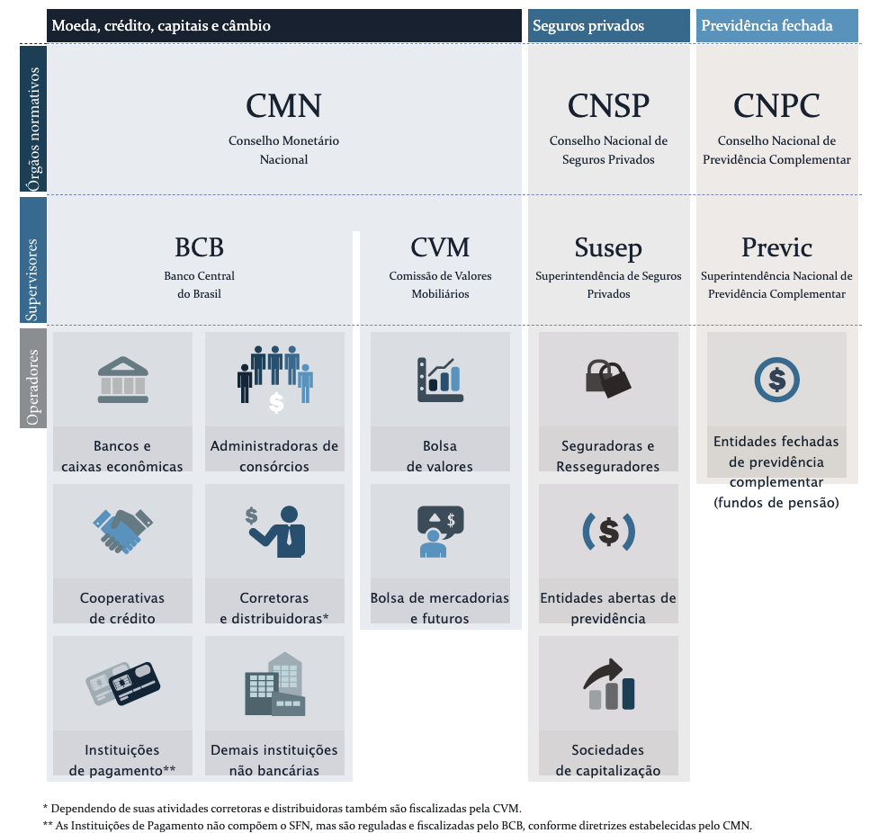

```{r mba0, include=FALSE}
setwd('/Users/jricardofl/Dropbox/tempecon/facape/mba2023')
#setwd("C:/Users/User client/Dropbox/tempecon/Facape/mba2023")

knitr::opts_chunk$set(
  echo       = TRUE,
  warning    = FALSE,
  message    = FALSE,
  comment    = NA,
  fig.width  = 10, 
  fig.height = 6,
  fig.align  = "center",
  comment    = "#",
  size       = "normalsize"
  )
```

<br>

# O Mercado de Trabalho

<br>

Como visto, a soma de bens e serviços finais produzidos por um país em um determinado período depende, basicamente, da disponibilidade de fatores de produção e da forma como esses fatores são combinados. Assim, é preciso entender sobre a dinâmica desses fatores, ou seja, sobre como a oferta e a demanda por eles evolui ao longo do tempo. 

Com esse objetivo, é importante definir alguns conceitos. O total de pessoas de um país divide-se em dois grandes grupos: a população inativa e a ativa. O primeiro grupo é composto, basicamente, por crianças e idosos, enquanto o segundo pelo grupo de pessoas que **estariam aptas a exercer algum tipo de trabalho**.

A **população em idade ativa (PIA)**, por sua vez, se divide em **população economicamente ativa (PEA)** e **população não economicamente ativa (PNEA)**. No primeiro grupo estão as **pessoas ocupadas (PO)** e as **pessoas desocupadas, mas em busca de ocupação (PD)**, enquanto no segundo estão as **pessoas desocupadas, que não estão buscando ocupação**. Em resumo:

<br>

$$
População = PIA + Inativos 
\tag{1}
$$
$$
PIA = PEA + PNEA
\tag{2}
$$

$$
PEA = PO + PD 
\tag{3}
$$

$$
PD = PEA - PO
\tag{4}
$$

$$
\frac{PD}{PEA} = 1 - \frac{PO}{PEA}
\tag{5}
$$

$$
Participação =  \frac{PEA}{PIA}
\tag{6}
$$

<br>

O que conhecemos, nesse contexto, como **taxa de desemprego** nada mais é do que a resultante final de uma complexa interação entre oferta e demanda de trabalho. O grau de ociosidade nesse mercado, por fim, vai definir a qual taxa os salários irão crescer, que pode ser maior, menor ou igual ao crescimento da produtividade da economia.

A análise do mercado de trabalho pode ser feita com base nos dados do CAGED (Cadastro Geral de Empregados e Desempregados) ou com os dados **Pesquisa Nacional por Amostra de Domicílios Contínua** organizada e divulgada pelo IBGE. A PNAD Contínua, de abrangência nacional, veio substituir a Pesquisa Mensal de Emprego (PME), que englobava apenas as seis maiores regiões metropolitanas do país. 

<br>

#### Evolução Dados sobre Mercado de Trabalho

``` {r mba1, fig.cap = 'Figura 1: Evolução Dados sobre Mercado de Trabalho'}

#Analise do Mercado de Trabalho
#https://sidra.ibge.gov.br/home/pnadcm
library(sidrar)
library(GetTDData)
library(readr)
library(xts)
library(forecast)
library(scales)
library(ggplot2)
library(mFilter)
library(grid)
library(png)
library(rbcb)
library(Quandl)
library(tidyverse)
library(plotly)
library(BMR)
library(plotly)
library(GetBCBData)
library(easyGgplot2)
#datamt0 <- get_sidra(api='/t/6022/n1/all/v/606/p/all') #Populacao
#datamt1 <- get_sidra(api='t/6318/n1/all/v/1641/p/all/c629/32385') #PIA+PD+PEA
#datamt2 <- get_sidra(api='t/6318/n1/all/v/1641/p/all/c629/32386')#PIA
#datamt3 <- get_sidra(api='t/6318/n1/all/v/1641/p/all/c629/32387')
#datamt4 <- get_sidra(api='t/6318/n1/all/v/1641/p/all/c629/32446')
#datamt5 <-get_sidra(api='/t/6320/n1/all/v/4090/p/all/c11913/31722,31723,31724,31727,31731,96165,96170,96171') #PIA
#http://api.sidra.ibge.gov.br/values/t/6323/n1/all/v/4090/p/first%2077/c693/all

#write.csv2(datamt0, file='arquivo12a.csv')

dataa <- ts(read.csv2('arquivo12a.csv', header=T,
                     sep=';'),
           start=c(2012,03), freq=12)

data <- ts(read.csv2('arquivo12.csv', header=T,
                     sep=';', dec=',', skip=4)[,-1],
           start=c(2012,03), freq=12)

data <- na.omit(data)

data <- cbind.data.frame(dataa[,6], data)

### Calcular Series e Taxas
pnea <- data[,2] - data[,3] # Populacao nao economicamente ativa
pia.pop <- data[,2]/data[,1]*100 # PIA/Populacao PIA= Pop. Idade Ativa
participacao <- data[,3]/data[,2]*100 # PEA/PIA PEA=PO+PD
ocupacao.pia <- data[,4]/data[,2]*100 # PO/PIA PO=POp Ocupada
desemprego <- data[,5]/data[,3]*100 #PD/PEA PD=Pop Desocupada

macro <- cbind(data[,1:5], pnea, pia.pop, participacao, ocupacao.pia,
               desemprego)
colnames(macro) <- c('Populacao', 'PIA', 'PEA', 'PO', 'PD', 'PNEA',
                     'PIA/POP', 'PARTICIPACAO', 'PO/PIA', 'DESEMPREGO')

macro <- ts(macro, start=c(2012,03), freq=12)
### Variacao internanual
interanual <- (macro/stats::lag(macro,-12)-1)*100
colnames(interanual) <- colnames(macro)

### Variacao internanual
interdecanual <- (macro/stats::lag(macro,-120)-1)*100
colnames(interanual) <- colnames(macro)

interanual1<-interanual[,-1]
#plot1 <- window(interanual1, end=c(2016,6))

dates <- seq(as.Date('2012-03-01'),
             as.Date('2022-12-01'), by='1 month')
macro1 <- macro[,-1]
gtsplot(macro1, dates=dates)
```

<br>

#### Mercado de Trabalho, Variação Interanual

<br>

```{r mba2, fig.cap = 'Figura 2: Variações Interanuais das métricas principais da PNAD Contínua'}
dates <- seq(as.Date('2013-03-01'),
             as.Date('2022-12-01'), by='1 month')
gtsplot(interanual1, dates=dates)
```

<br>

#### Métricas da PNAD Contínua

<br>

```{r mba3}
#Tabela

c1 <- tail(macro, n=1)
c2 <- macro[nrow(macro)-12,]
c3 <- tail(interanual, n=1)
c4 <- macro[nrow(macro)-120,]
table <- t(rbind(c1,c2,c3,c4))
colnames(table) <- c('Dez/22', 'Dez/21', 'Variação', 'Dez/12')

library(DT)

datatable(round(table,2),
          options = list(pageLength = 11,
                         dom = 't',
                         columnDefs = 
                           list(list(className = 'dt-center', targets = "_all"))))
```

<br>

#### Desagregação da População Ocupada

De forma a compreender o comportamento da demanda por trabalho, é importante saber desagregar os dados da PNAD Contínua.

<br>

```{r mba4, fig.cap = 'Figura 3: Desagregação da População Ocupada'}
#datab <- get_sidra(api='t/6320/n1/all/v/4090/p/all/c11913/31722,31723,31724,31727,31731,96170,96171')

datab <- ts(read.csv2('arquivo12b.csv', header=T,
                     sep=';', dec=',', skip=4)[,-1],
           start=c(2012,03), freq=12)

pesos.po <- na.omit(datab)

pesos.po1 <- (pesos.po/data[,4])*100

colnames(pesos.po1) <- c("Privado com Carteira",
                         "Privado sem Carteira",
                         "Trabalhador Domestico",
                         "Setor Publico",
                         "Empregador","Conta Propria",
                         "Trabalhador Familiar Auxiliar")

### Gerar Grafico
pie(colMeans(pesos.po1), col=c('red','black','blue','darkblue',
                               'darkgreen', '367', '556'),
    main='Populacao Ocupada PNADC mensal desagregada (%)')
```

```{r mba5, fig.cap = 'Figura 4: Desagregação da População Ocupada'}
pesos.po2 <- window(pesos.po1, start=c(2017,3), end=c(2020,3))
### Gerar Grafico
pie(colMeans(pesos.po2), col=c('red','black','blue','darkblue',
                               'darkgreen', '367', '556'),
    main='Populacao Ocupada PNADC mensal desagregada (%) - Pré Pandemia')
```


```{r mba6, fig.cap = 'Figura 5: Desagregação da População Ocupada'}
pesos.po3 <- window(pesos.po1, start=c(2020,3))
### Gerar Grafico
pie(colMeans(pesos.po3), col=c('red','black','blue','darkblue',
                               'darkgreen', '367', '556'),
    main='Populacao Ocupada PNADC mensal desagregada (%) - Pós Pandemia')
```

```{r mba7}
pie1 <- colMeans(pesos.po1)
pie2 <- colMeans(pesos.po2)
pie3 <- colMeans(pesos.po3)

table <- cbind(pie1, pie2, pie3)

colnames(table) <- c("Média Série", "Média pós 2017", "Média pós 2020")

datatable(round(table,2),
          options = list(pageLength = 7,
                         dom = 't',
                         columnDefs = 
                           list(list(className = 'dt-center', targets = "_all"))))
```

<br>

#### Variação Interanual da Taxa de Desemprego PNADC

Uma outra métrica interessante para análise da situação do desemprego pode ser obtida confrontando o dado em t contra o mesmo dado em t-12. Obtém-se, assim, o chamado de variação interanual do desemprego.

<br>

```{r mba8, fig.cap = 'Figura 6: Variação Interanual da Taxa de Desemprego PNADC'}
#interanual <- (macro/lag(macro,-12)-1)*100
#Variacao Interanual do Desemprego
composicao <- macro[,10] - stats::lag(macro[,10],-12)
autoplot(composicao) +
  geom_bar(colour="black",
           fill="darkblue", width=.1, stat="identity") +
  xlab('') + ylab('p.p.') +
  ggtitle('Variação da Taxa de Desemprego PNADCm
          (mes t menos mes t-12)')

```

<br>

#### Dessazonalização da taxa de desemprego

Um dos grandes problemas da PNAD Contínua é que ela é uma série curta. Isso significa que não é possível usar técnicas econométricas mais sofisticadas. Contudo, é possível contornar o problema estimando o modelo dinâmico abaixo:

<br>

```{r mba9, fig.cap = 'Figura 7: Taxa de Desemprego na PNAD Contínua mensal (% PEA)'}

library(dynlm)
#Dessazonalizacao da taxa de desemprego
dynlm <- dynlm(macro[,10]~season(macro[,10]))
desemprego_sa <- residuals(dynlm) + mean(fitted(dynlm))
pnadc.desemprego <- cbind(desemprego, desemprego_sa)

p <- autoplot(pnadc.desemprego, facets=F,
              main='Taxa de Desemprego na PNAD Continua mensal (% PEA)', xlab = "%", ylab = "Tempo")
p + scale_colour_hue("Legenda") + scale_size_manual(values = 2)+
  theme(legend.position="bottom")

```

<br>

### Rendimentos

<br>

Uma questão importante em relação ao mercado de trabalho é o rendimento recebido pela força de trabalho. Para fazer esta análise os dados da evolução do Rendimento médio de todos os trabalhos, efetivamente recebido no mês de referência, pelas pessoas de 14 anos ou mais de idade, ocupadas na semana de referência, com rendimento de trabalho (Reais), disponibilizado pelo IBGE pode ser utilizado. 


```{r mba10, fig.cap = 'Figura 8: Rendimentos Reais', fig.width  = 9}
renda <- read.csv(file='arquivo12c.csv',
                header=T,sep=";", skip=3)
colnames(renda)[2] <- "renda"
renda <- ts(renda[-nrow(renda),-1], start=c(2012,02), freq=12)

#Analise do PIB e seus componentes
dates <- seq(as.Date('2012-02-01'), as.Date('2022-11-01'), by='1 month')

renda <- data.frame(time=dates, renda)
renda1 <- ggplot(renda, aes(x=time))+
  geom_line(aes(y=renda), color="darkblue", linewidth=.6)+
  scale_y_continuous(limits=c(2000, 3500), n.breaks = 10)+
  xlab('')+ylab('Reais')+
  theme(legend.position = 'top')

ggplotly(renda1)
```

<br> 

#### Rendimentos - Variação Marginal

<br>

``` {r mba11, fig.cap = 'Figura 9: Variação Marginal', fig.width  = 9}
### Variacao Marginal (comparo com o trimestre anterior)
margem <- (renda[,2]/stats::lag(renda[,2],-1)-1)*100

dates <- seq(as.Date('2012-03-01'), as.Date('2022-11-01'), by='1 month')

margem <- data.frame(time=dates, margem)
margem1 <- ggplot(margem, aes(x=time))+
  geom_line(aes(y=margem), color="darkblue", linewidth=.6)+
  xlab('')+ylab('Variação %')+
  theme(legend.position = 'top')

ggplotly(margem1)
```

<br>

#### Rendimentos - Variação Anual

<br>

``` {r mba12, fig.cap = 'Figura 10: Variação Anual', fig.width  = 9}
### Variacao Marginal (comparo com o mesmo mes do anterior anterior)
anual <- (renda[,2]/stats::lag(renda[,2],-12)-1)*100

dates <- seq(as.Date('2013-02-01'), as.Date('2022-11-01'), by='1 month')

anual <- data.frame(time=dates, anual)
anual1 <- ggplot(anual, aes(x=time))+
  geom_line(aes(y=anual), color="darkblue", linewidth=.6)+
  xlab('')+ylab('Variação %')+
  theme(legend.position = 'top')

ggplotly(anual1)
```

<br>

# Inflação

<br>

Nível geral de preços é uma medida acumulada do comportamento agregado dos preços de bens e serviços de uma economia em determinado período do tempo, geralmente expressa por meio de números índices. 

A inflação é a taxa de crescimento do nível geral de preços entre dois períodos distintos.

Ao contrário do que o senso comum acredita, o aumento no preço de um determinado bem ou serviço não pode ser caracterizado com o que estamos definindo como inflação. Para ser considerado inflação, é necessário que haja um aumento persistente e generalizado de preços.

No curto prazo, diversos fatores podem afetar a taxa de crescimento dos preços, desde uma quebra de
safra, que pode gerar um aumento localizado nos preços de alimentos, o que gera uma pressão inflacionária, até questões cambiais que aumentem o custo de importação de insumos em diversas cadeias produtivas, acaba gerando também uma pressão inflacionária. No curto prazo os economistas usam a Curva de Phillips para verificar a dinâmica da inflação.

$$
\pi_{t} = \alpha_{0} + \alpha_{1}\pi_{t-1} + \alpha_{2}E_{t}\pi_{t+1} + \alpha_{3}h_{t-1} + \alpha_{4}\Delta\epsilon_{t} + \varepsilon_{t}^{s} 
\tag{7}
$$

onde $\pi_{t}$ é a inflação, $\Delta\epsilon_{t}$ é a primeira diferença da taxa de câmbio nominal e $\varepsilon_{t}^{s}$ é um choque de oferta.

Para entender inflação no longo prazo, pode-se usar a equação de Cambridge, a partir do equilíbrio entre demanda 

$$
M^{d} = kPY
\tag{8}
$$ 
e oferta de moeda 

$$
M^{s} = M
\tag{9}
$$ 

Igualando (8) e (9) e reordenando os termos, chega-se à equação:

$$
P = \frac{M}{kY}
\tag{10}
$$
	
<br>

Aplicando logaritmo e derivando em relação ao tempo, tem-se que:

$$
\dot{P} = \dot{M} - \dot{k} - \dot{Y}
\tag{11}
$$
Como $k$ (o coeficiente de Cambridge) é o inverso da velocidade renda da moeda ($1/V$ com V entendida como o número de giros da moeda *criando renda*), ou seja, a retenção média de moeda em relação à renda nacional nominal, e por hipótese, é constante, tem-se que:

$$
\dot{P} = \dot{M} - \dot{Y}
\tag{12}
$$

Assim, **a taxa de crescimento do nível geral de preços é dada pela diferença entre a taxa de crescimento dos meios de pagamento e do produto real da economia**.

Se a inflação é determinada positivamente pela taxa de crescimento dos meios de pagamento, fica claro que a condução frouxa da política monetária gera mais inflação. Dito de outra forma, pode-se relacionar a taxa de crescimento dos meios de pagamento à inflação através da taxa de juros. 

A política monetária via taxa de juros é o instrumento para controlar a inflação, consequentemente. política monetária será expansionista se a taxa de juros de curto prazo estiver abaixo daquela considerada de equilíbrio entre oferta e demanda por "fundos emprestáveis", como dito por Wicksell (1898). Assim, o Bacen deve calibrar a taxa básica de juros em torno daquela considerada de equilíbrio, natural ou neutra, de modo a manter a estabilidade de preços na economia. 

<br>

#### Nível Geral de Preços ao redor do mundo

<br>

O Banco Mundial disponibiliza um conjunto de dados sobre Nível geral de preços e inflação em diversos países. Assim, basta baixar o CPI (Consumer Price Index) e depois calcular a inflação comparando dois períodos de tempo. Os dados mostrados são de 2000 a 2021, último dado disponível. 

```{r mba13, fig.cap = 'Figura 11: Evolução Índices de Preços em Países selecionados'}
library(wbstats)
#CPI <- wb_data("FP.CPI.TOTL", start_date = 2000, end_date = 2022)

#BRA_CPI <- filter (CPI, iso3c == 'BRA')
#colnames(BRA_CPI)[5] <- 'BRA_CPI'
#USA_CPI <- filter (CPI, iso3c == 'USA')
#colnames(USA_CPI)[5] <- 'USA_CPI'
#DEU_CPI <- filter (CPI, iso3c == 'DEU')
#colnames(DEU_CPI)[5] <- 'DEU_CPI'
#CAN_CPI <- filter (CPI, iso3c == 'CAN')
#colnames(CAN_CPI)[5] <- 'CAN_CPI'
#FRA_CPI <- filter (CPI, iso3c == 'FRA')
#colnames(FRA_CPI)[5] <- 'FRA_CPI'
#ITA_CPI <- filter (CPI, iso3c == 'ITA') 
#colnames(ITA_CPI)[5] <- 'ITA_CPI'
#JPN_CPI <- filter (CPI, iso3c == 'JPN') 
#colnames(JPN_CPI)[5] <- 'JPN_CPI'
#GBR_CPI <- filter (CPI, iso3c == 'GBR')
#colnames(GBR_CPI)[5] <- 'GBR_CPI'
#MEX_CPI <- filter (CPI, iso3c == 'MEX')
#colnames(MEX_CPI)[5] <- 'MEX_CPI'

#CPI <- tibble(BRA_CPI[,5], USA_CPI[,5], DEU_CPI[,5], CAN_CPI[,5], FRA_CPI[,5], ITA_CPI[,5], JPN_CPI[,5], GBR_CPI[,5], MEX_CPI[,5])

#write.csv2(CPI, file='arquivo13.csv')

CPI <- ts(read.csv2('arquivo13.csv', header=T,
                     sep=';')[,-1], start=c(2000))

dates <- seq(as.Date('2000-01-01'),
             as.Date('2021-01-01'), by='1 year')
gtsplot(CPI, dates=dates)

```

<br>

De maneira geral, o Nível Geral de Preços apresenta uma tendência positiva. Isto é, os preços tendem a subir ao longo do tempo. A velocidade desse crescimento vai depender, em termos estruturais, da condução da política monetária e, em termos conjunturais, de fatores especificados na Curva de Phillips.

<br>

#### Inflação ao redor do mundo

<br>

```{r mba14, fig.cap = 'Figura 12: Evolução Inflação em países selecionados'}

INF <- (CPI/stats::lag(CPI,-1)-1)*100

colnames(INF) <- c('BRA_INF', 'USA_INF', 'DEU_INF', 'CAN_INF', 'FRA_INF', 'ITA_INF', 'JPN_INF', 'GBR_INF', 'MEX_INF')

inflacao <- ts(INF,start=c(2001))
dates <- seq(as.Date('2001-01-01'),
             as.Date('2021-01-01'), by='1 year')
gtsplot(inflacao, dates=dates)
```

<br>

#### Inflação no Brasil

<br>

O Brasil possui diversos índices de inflação com metodologias diferentes, calculados por institutos diferentes. Aqui será trabalhado o Índice de Preços ao Consumidor Amplo (IPCA), o índice que serve de referência para o regime de metas de inflação (Vigente no país desde 1999, conforme exposto no decreto **https://www.planalto.gov.br/ccivil_03/decreto/d3088.htm**.

O Índice de Preços ao Consumidor Amplo (IPCA) faz parte do Sistema Nacional de Índices de Preços ao Consumidor (SNIPC).

A periodicidade do IPCA é mensal, abrangendo as regiões metropolitanas de Belém, Fortaleza, Recife, Salvador, Belo Horizonte, Rio de Janeiro, São Paulo, Curitiba, Vitória e Porto Alegre, Brasília e municípios de Goiânia e Campo Grande.

O IPCA é construído de forma hierarquizada, sendo dividido em grupos, subgrupos, itens e subitens. Desde agosto de 1999, são nove os grupos: alimentos e bebidas, habitação, artigos de residência, vestuário, transportes, comunicação, saúde e cuidados pessoais, despesas pessoais e educação. 

O peso de cada um desses grupos no índice cheio é definido mensalmente, de acordo com os gastos das famílias em diferentes bens e serviços. Estes gastos, por sua vez, são captados pela Pesquisa de Orçamento Familiar (POF).

A cada grupo estarão, então, vinculados subgrupos, itens e subitens. Atualmente, o IPCA possui 377 subitens, distribuídos por 52 itens e 19 subgrupos. Todos os meses, então, o IBGE calculará a variação do preço de cada um desses subitens em relação ao mês anterior, bem como verificará o peso dele no índice cheio. O somatório do produto entre variação mensal e peso de todos os 373 subitens dará a variação mensal do índice cheio.

<br>

```{r mba15, fig.width  = 8}
#datainfl0 <- get_sidra(api='t/1737/n1/all/v/2266/p/all/d/v2266%2013')

data <- ts(read.csv2('arquivo13a.csv', header=T,
                     sep=';', dec='.', skip=3)[,-1],
           start=c(1980,12), freq=12)

data <- na.omit(data) %>%
        window(start = c(1997,1))

colnames(data) <- c('IPCA', 'IPCA-Var Mensal', 'IPCA - Acumulado')

dates <- seq(as.Date('1997-01-01'), as.Date('2023-02-01'), by='1 month')

ipca <- data.frame(time=dates, ipca=data[,1])
ipca1 <- ggplot(ipca, aes(x=time))+
  geom_line(aes(y=ipca), color="darkblue", linewidth=.6)+
  xlab('Meses do Ano')+ylab('IPCA - Número Índice')+
  theme(legend.position = 'top')

ggplotly(ipca1)

ipca_mes <- data.frame(time=dates, ipca_mes=data[,2])
ipca1_mes <- ggplot(ipca_mes, aes(x=time))+
  geom_line(aes(y=ipca_mes), color="darkblue", linewidth=.6)+
  xlab('Meses do Ano')+ylab('IPCA - Variação Mensal (%)')+
  theme(legend.position = 'top')

ggplotly(ipca1_mes)

ipca_ano <- data.frame(time=dates, ipca_ano=data[,3])
ipca1_ano <- ggplot(ipca_ano, aes(x=time))+
  geom_line(aes(y=ipca_ano), color="darkblue", linewidth=.6)+
  xlab('Meses do Ano')+ylab('IPCA - Variação Acumulada em 12 meses (%)')+
  theme(legend.position = 'top')

ggplotly(ipca1_ano)
```

<br>

#### IPCA por Grupos

A variação mensal dos nove grupos, como mostrado abaixo, não diz muita coisa sobre o comportamento dos mesmos ao longo do tempo. Já com relação aos pesos, é possível, mesmo com variação mensal, obter algumas tendências. 

<br>

```{r mba16}

ipca <- ts(read.csv(file='arquivo14.csv', header=T,sep=";",dec=".")[,-1], start=c(1999,08), freq=12)

dates <- seq(as.Date('2003-02-01'), as.Date('2023-02-01'), by='1 month')
#Conjuntura 23
gtsplot(window(ipca[,c(1,4:11)], start=c(2003,02)), dates=dates)
#Conjuntura 24
gtsplot(window(ipca[,c(12,15:22)], start=c(2003,02)), dates=dates)

```
<br>

Para verificar se um determinado grupo tem pressionado mais ou menos o índice cheio, uma opção é acumular a variação mensal dos últimos 12 meses. Com isso, é possível verificar de uma forma melhor se há ou não pressão ao longo do tempo.

<br>

```{r mba17}
####### Variacoes acumuladas em 12 meses dos grupos ########
fator <- (1+(ipca[,c(1,4:11)]/100))
vanual <- (fator*stats::lag(fator,-1)*stats::lag(fator,-2)*stats::lag(fator,-3)*stats::lag(fator,-4)*stats::lag(fator,-5)*stats::lag(fator,-6)*stats::lag(fator,-7)*stats::lag(fator,-8)*stats::lag(fator,-9)*stats::lag(fator,-10)*stats::lag(fator,-11)-1)*100
colnames(vanual) <- colnames(ipca[,c(1,4:11)])

############ GRAFICOS DOS GRUPOS NO ACUMULADO EM 12 MESES #########
dates <- seq(as.Date('2003-02-01'), as.Date('2023-02-01'), by='1 month')
gtsplot(window(vanual,start=c(2003,2)), dates=dates)
```

<br>

#### IPCA por Item (Manga e Uva)

<br>

```{r mba18}
dates <- seq(as.Date('2003-02-01'), as.Date('2023-02-01'), by='1 month')
#Conjuntura 23
gtsplot(window(ipca[,c(2:3)], start=c(2003,02)), dates=dates)
#Conjuntura 24
gtsplot(window(ipca[,c(13:14)], start=c(2003,02)), dates=dates)
```

<br>

#### Contribuições Mensais para o índice cheio

<br>

Com a variação mensal e o peso dos 9 grupos do IPCA e, a partir da contribuiçã de cada um, se obtém a variação mensal do índice cheio.

<br>

```{r mba19}
contribuicao <- ipca[,c(1,4:11)]*ipca[,c(12,15:22)]/100
colnames(contribuicao) <- colnames(ipca[,c(1,4:11)])

##### O IPCA sera a soma das contribuicoes de cada grupo #####
ipcamensal <- ts(round(apply(contribuicao, MARGIN=1, FUN=sum), digits=2), start=c(1999,8), freq=12)

plot(ipcamensal, bty='l', col='red', xlab='', ylab='% a.m.',
     main='IPCA Mensal')

########### TABELA COM AS CONTRIBUICOES DOS ULTIMOS MESES ###########
contribuicao <- tail(round(cbind(ipcamensal,contribuicao), digits=2), n=6)
contribuicao <- t(contribuicao)
colnames(contribuicao) <- c('Setembro/18', 'Outubro/22', 'Novembro/22', 'Dezembro/22', 'Janeiro/23', 'Fevereiro/23')
rownames(contribuicao) <- c('IPCA Mensal', 'Alimentos','Habitacao', 'Residencia', 'Vestuario', 'Transportes', 'Saude','Despesas Pessoais', 'Educacao', 'Comunicacao')

datatable(contribuicao,
          options = list(pageLength = 10,
                         dom = 't',
                         columnDefs = 
                           list(list(className = 'dt-center', targets = "_all"))))
```

<br>

#### Índice de Difusão

<br>

Índices de difusão mostram, em termos percentuais, a quantidade de bens e serviços que sofreram variação positiva em determinado período em relação a todos os bens e serviços avaliados. Como pode ser observado abaixo, 65,25% dos bens e serviços acompanhados pelo IPCA tiveram variação positiva de preços em fevereiro de 2023.

<br>

```{r mba20}
subitens <- read.csv2('arquivo15.csv', header=T, sep=";", dec=".", skip=4, col.names=c('subitens', 'variacao', 'peso'))
subitens <- na.omit(subitens)

library(plyr)
dados <- ifelse(subitens$variacao>0, 1,0)
difusao <- round((count(dados==1)/length(dados))$freq[2]*100,digits=2)
difusao
```

<br>

# Mercado de Crédito

<br>

A função básica de um sistema financeiro é intermediar agentes deficitários e superavitários, estimulando a formação de poupança financeira, a transferência dessa poupança, bem como a promoção de liquidez. Esse sistema, por suposto, deve ser regulado por instituições governamentais capazes de
garantir a sua estabilidade (FEIJÓ et al, 2008). 

<br>

{width="100%"} 

<br>

Em particular, destaca-se o CMN, responsável por estabelecer a política monetária e credítica do país; o Banco Central, responsável pela estabilidade do poder de compra da moeda e do sistema financeiro; os Bancos Comerciais e as cooperativas de crédito **"instituições financeiras formadas pela associação de pessoas para prestar serviços financeiros exclusivamente aos seus associados. Os cooperados são ao mesmo tempo donos e usuários da cooperativa, participando de sua gestão e usufruindo de seus produtos e serviços. Nas cooperativas de crédito, os associados encontram os principais serviços disponíveis nos bancos, como conta-corrente, aplicações financeiras, cartão de crédito, empréstimos e financiamentos. Os associados têm poder igual de voto independentemente da sua cota de participação no capital social da cooperativa. O cooperativismo não visa lucros, os direitos e deveres de todos são iguais e a adesão é livre e voluntária."** 

Um sistema financeiro razoavelmente desenvolvido envolve, em termos gerais, quatro mercados: monetário, de câmbio, de capitais (não vai ser tema deste curso) e de crédito.

<br>

#### Operações de crédito do SFN

<br>

A soma de todas as operações de empréstimos para pessoas físicas e jurídicas realizadas por instituições financeiras corresponde ao que se chama de mercado de crédito. 

Nesta análise os dados trabalhados são obtidos das séries 20631 (Concessões de crédito - Total), 20632 (Concessões de crédito - Pessoas jurídicas - Total), 20633 (Concessões de crédito - Pessoas físicas - Total), 20634 (Concessões de crédito com recursos livres - Total) e 20685 (Concessões de crédito com recursos direcionados). 

Por concessões entende-se "desembolsos referentes a empréstimos e financiamentos efetivamente creditados ao tomador do crédito. Os valores informados correspondem às concessões ocorridas no mês de referência". 

* 20631 (Concessões de crédito - Total): Valor das novas operações de crédito contratadas no período de referência no Sistema Financeiro Nacional. Inclui operações contratadas no segmento de crédito livre e no segmento de crédito direcionado.

* 20634 (Concessões de crédito com recursos livres - Total): Valor das novas operações de crédito contratadas no período de referência com taxas de juros livremente pactuadas entre mutuários e instituições financeiras. Não inclui operações referenciadas em taxas regulamentadas, operações vinculadas a recursos do Banco Nacional de Desenvolvimento Econômico e Social (BNDES) ou quaisquer outras lastreadas em recursos compulsórios ou governamentais.

Nas operações livres, as instituições financeiras têm autonomia sobre a destinação dos recursos captados no mercado.

* 20685 (Concessões de crédito com recursos direcionados): Valor das novas operações de crédito regulamentado pelo Conselho Monetário Nacional (CMN) ou vinculado a recursos orçamentários, contratadas no período de referência. Refere-se aos financiamentos com destinação específica, vinculados à comprovação da aplicação dos recursos voltados para a produção e investimento de médio e longo prazos, tendo como fonte de recursos parte das captações de depósitos à vista e de caderneta de poupança, e fundos e programas públicos. 

**Modalidades do crédito livre:** Adiantamentos sobre contratos de câmbio (ACC), Antecipação de faturas de cartão de crédito, Arrendamento mercantil de veículos, Arrendamento mercantil de outros bens, Aquisição de veículos, Aquisição de outros bens, Capital de giro com prazo até 365 dias, Capital de giro com prazo superior a 365 dias, Capital de giro com teto rotativo, Cartão de crédito – compras à vista, Cartão de crédito – parcelado, Cartão de crédito – rotativo, Cheque especial, Compror, Conta garantida, Crédito pessoal consignado para aposentados e pensionistas do INSS, Crédito pessoal consignado para trabalhadores do setor privado, Crédito pessoal consignado para trabalhadores do setor público, Crédito pessoal não consignado, Crédito pessoal não consignado vinculado a renegociação de dívidas, Desconto de duplicatas, Desconto de cheques, Financiamento à exportação, Financiamento à importação, Outros créditos livres, Repasse externo, e Vendor.

**Modalidades de crédito direcionado**: Financiamentos rurais com taxas reguladas, Financiamentos rurais com taxas de mercado, Financiamentos imobiliários com taxas reguladas, Financiamentos imobiliários com taxas de mercado, Financiamentos com recursos do BNDES para infraestrutura, Financiamentos com recursos do BNDES para agroindústria, Financiamentos com recursos do BNDES para capital de giro e exportações, Microcrédito, e Outros créditos direcionados.

* Crédito livre:

  + Adiantamentos sobre contratos de câmbio (ACC): antecipação parcial ou total de recursos vinculados a contratos de exportação, com o objetivo de financiar a produção das mercadorias a serem exportadas. Inclui as operações de adiantamentos de cambiais entregues (ACE).

  + Antecipação de faturas de cartão de crédito: adiantamento de recursos a pessoas jurídicas com base em fluxo de caixa futuro vinculado a direitos creditórios sob a forma de faturas de cartão de crédito.

  + Arrendamento mercantil (veículos / outros bens): operações de arrendamento mercantil (leasing) financeiro, em que o arrendador concede ao arrendatário a utilização do objeto do contrato de arrendamento (veículos / outros bens), com opção de compra ao final do contrato.

  + Aquisição de bens (veículos / outros bens): financiamentos para compra de bens (veículos / outros bens) destinados à manutenção ou ao aumento da capacidade produtiva das pessoas jurídicas contratantes, configurando-se como investimento, ou ao consumo das pessoas físicas contratantes. No caso de veículos, o contrato deve conter cláusula de alienação fiduciária, com o bem financiado constituindo a garantia da operação. Os financiamentos de veículos destinados à formação de estoques comerciais não são classificados nesta modalidade.

  + Capital de giro com prazo até 365 dias: crédito de curto prazo destinado a financiar as atividades operacionais das empresas, vinculada a um contrato específico que estabeleça prazos, taxas e garantias, observado o prazo de contratação igual ou inferior a 365 dias.

  + Capital de giro com prazo superior a 365 dias: crédito de médio e longo prazo destinado a financiar as atividades operacionais das empresas, vinculada a um contrato específico que estabeleça prazos, taxas e garantias, observado o prazo de contratação superior a 365 dias.

  + Capital de giro com teto rotativo: crédito destinado a financiar atividades operacionais das empresas, vinculado a contrato que estabeleça linha de crédito rotativo e amortizações com datas pré-determinadas.

  + Cartão de crédito – compras à vista: corresponde às compras à vista realizadas no cartão de crédito, e às compras parceladas pelos lojistas (afiliados), em que não há incidência de juros.

  + Cartão de crédito – parcelado: compreende o parcelamento de compras realizadas com cartão de crédito ou dos valores referentes à fatura do cartão, mediante a cobrança de juros. Inclui as operações de saques em dinheiro com pagamentos parcelados com o uso do cartão na função crédito.

  + Cartão de crédito – rotativo: operações de financiamento do saldo devedor remanescente após vencimento da fatura e operações de saque com pagamento à vista em dinheiro efetuadas na função crédito.

  + Cheque especial: crédito rotativo vinculado à conta corrente, em que determinado limite de recursos é disponibilizado para utilização pelo cliente em situações não programadas e de curto prazo, por meio de saques, cheques, pagamentos ou transferências bancárias. As operações classificadas nessa modalidade devem ter como característica a amortização automática do saldo devedor quando ocorrer depósitos na conta corrente do tomador do crédito. As operações de adiantamento à depositante ou a lojistas, que configuram a utilização em excesso ao limite de crédito estabelecido em contrato, são consideradas nessa modalidade.

  + Compror: operações de crédito a pessoas jurídicas voltadas para o financiamento de suas compras (produtos e serviços), caracterizada pelo fato de que o desembolso inicial ocorre com o pagamento à vista das compras, pela instituição financeira, diretamente ao fornecedor. Estão inclusas nessa modalidade as operações de Floor Plan, destinadas ao financiamento dos estoques das revendedoras de veículos.

  + Conta garantida: crédito rotativo vinculado à conta bancária de pessoas jurídicas, em que determinado limite de recursos é disponibilizado para utilização pelo cliente, por meio da movimentação da conta corrente e/ou solicitação formal à instituição financeira, a qual pode, eventualmente, solicitar a vinculação de garantias de recebíveis, ou outras garantias, ao limite do cliente. As operações de adiantamento a lojistas, que configuram a utilização em excesso ao limite de crédito estabelecido em contrato, são consideradas nessa modalidade

  + Crédito pessoal consignado para aposentados e pensionistas do INSS: operações de crédito a aposentados e pensionistas do Instituto Nacional de Seguro Social (INSS), com retenção de parte do benefício do contratante pelo INSS para o pagamento das parcelas do empréstimo – desconto em folha de pagamento.

  + Crédito pessoal consignado para trabalhadores do setor privado: crédito destinado a empregados do setor privado, com retenção de parte do salário do contratante pelo empregador para o pagamento das parcelas do empréstimo – desconto em folha de pagamento.

  + Crédito pessoal consignado para trabalhadores do setor público: crédito destinado a servidores públicos federais, estaduais e municipais, ativos ou inativos, com retenção, por parte do órgão público ao qual o servidor está vinculado, de parte do salário ou rendimento de aposentadoria para o pagamento das parcelas do empréstimo – desconto em folha de pagamento.

  + Crédito pessoal não consignado: linha de crédito às pessoas físicas sem vinculação com aquisição de bem ou serviço, e sem retenção de parte do salário ou benefício do contratante para o pagamento das parcelas do empréstimo (desconto em folha de pagamento).

  + Crédito pessoal não consignado vinculado a renegociação de dívidas: operações de empréstimos a pessoas físicas associadas a composição de dívidas vencidas envolvendo modalidades distintas. As composições de dívidas entre operações de mesma modalidade estão registradas na modalidade de origem.

  + Desconto de duplicatas: adiantamento de recursos a pessoas jurídicas com base em fluxo de caixa futuro vinculado a duplicatas mercantis e a outros tipos de recebíveis, exceto cheques e faturas de cartão de crédito.

  + Desconto de cheques: adiantamento de recursos a pessoas jurídicas com base em fluxo de caixa futuro vinculado a cheques custodiados.

  + Financiamento à exportação: financiamentos para a venda de bens e serviços ao exterior e que não ACC e ACE. Inclui export notes e operações com Cédulas de Crédito à Exportação (CCE) e Notas de Crédito à Exportação (NCE).

  + Financiamento à importação: financiamentos destinados à compra de bens ou serviços no exterior, vinculados a linhas de crédito externas.

  + Repasse externo: linha de crédito com recursos captados no exterior por instituição financeira, com base na Resolução nº 3.844, de 23 de março de 2010, contratadas por pessoas jurídicas localizadas no país, e que não se enquadrem nas modalidades ACC, financiamento à importação e financiamento à exportação.

  + Vendor: operações de financiamento de vendas baseadas no princípio da cessão de crédito, que permite à empresa tomadora do empréstimo (fornecedor/vendedor) vender seus produtos a prazo e receber o pagamento à vista da instituição financeira. A empresa compradora assume o compromisso de efetuar o pagamento a prazo, destinado a liquidar a operação junto à instituição financeira. Em geral, a instituição financeira ficará com os direitos creditórios da empresa vendedora, à qual caberá o risco da operação.

  + Outros créditos livres: referem-se às operações de crédito com recursos livres que não foram enquadradas nas modalidades anteriores, a exemplo de operações de desconto de notas promissórias, arrendamento mercantil operacional e renegociação de dívidas no segmento de pessoas jurídicas e as operações de penhor no segmento de pessoas físicas.

* Crédito direcionado:

  + Crédito rural com taxas reguladas: operações realizadas em consonância com as diretrizes do direcionamento definidas pelo CMN (estabelece, entre outros parâmetros, o volume de financiamento e a taxa máxima de juros para cada produto), consolidadas no Manual de Crédito Rural (MCR), destinadas a produtores rurais pessoas físicas e jurídicas. Estão incluídas nessa modalidade as operações de crédito rural relacionadas com fundo constitucional.

  + Crédito rural com taxas de mercado: operações realizadas em consonância com as diretrizes do direcionamento definidas pelo CMN, consolidadas no Manual de Crédito Rural (MCR), mas pactuadas com taxas de mercado, destinadas a produtores rurais pessoas físicas e jurídicas. Estão incluídas nessa modalidade as operações de crédito rural relacionadas com fundo constitucional.

  + Financiamento imobiliário com taxas reguladas: compreendem as operações de financiamento habitacional relacionadas com a exigibilidade de direcionamento a que se refere o art. 1º, inciso I, alínea “a” do regulamento anexo à Resolução nº 3.932, de 2010, assim como as relacionadas com recursos de origem orçamentária ou de fundos e/ou programas governamentais.

  + Financiamento imobiliário com taxas de mercado: compreendem as operações de financiamento imobiliário relacionadas com a exigibilidade de direcionamento a que se refere o art. 1º, inciso I, alínea “b” do regulamento anexo à Resolução nº 3.932, de 2010, assim como as operações relacionadas com outras fontes de recursos captados em mercado.

  + Capital de giro com recursos do BNDES: operações de capital de giro e de financiamentos a exportações vinculadas a recursos do BNDES.

  + Financiamento de investimentos com recursos do BNDES: financiamentos de investimentos vinculados a recursos do BNDES.

  + Financiamento agroindustrial com recursos do BNDES: financiamentos agroindustriais vinculados a recursos do BNDES.

  + Microcrédito – consumo: operações de microcrédito destinadas ao consumo contratadas com recursos lastreados em depósitos a vista, nos termos definidos pela Resolução nº 3.422, de 30 de novembro de 2006.

  + Microcrédito – microempreendedor: refere-se às operações de microcrédito destinadas a microempreendedores contratadas com recursos lastreados em depósitos a vista, nos termos definidos pela Resolução nº 3.422, de 2006. As operações de microcrédito para pessoas jurídicas, nos termos dos incisos II e IV, do art.2º dessa Resolução estão incluídas nessa modalidade.

  + Microcrédito – consignado: refere-se às operações de microcrédito com retenção de parte do salário do contratante para o pagamento das parcelas do empréstimo (desconto em folha de pagamento) contratadas com recursos referenciados em depósitos a vista, nos termos definidos pela Resolução nº 3.422, de 2006.

  + Outros créditos direcionados: referem-se às operações de crédito direcionado que não se enquadrem nas modalidades listadas anteriormente

<br>

```{r mba21, fig.cap = 'Fluxo de Crédito'}
#dados_sgs <- GetBCBData::gbcbd_get_series(
#id = c("Total" = 20631, "PJ" = 20632, "PF" = 20633, "Livres" = 20634, "Direcionados" = 20685),
#first.date = "2011-03-01",
#last.date = "2023-01-01",
#format.data = "wide"
#)
#tail(dados_sgs)

#write.csv2(dados_sgs, file='arquivo20.csv')

concessoes <- ts(read.csv2('arquivo20.csv',
                       header=T, sep=';')[,-c(1,2)],
             start=c(2011,03), freq=12)

dates <- seq(as.Date('2011-03-01'), as.Date('2023-01-01'), by='1 month')
gtsplot(concessoes[,c(2:5)], dates=dates)
```

<br>

```{r mba22, fig.cap = 'Fluxo de Crédito: Variação Interanual e Anual'}
## Interanual
interanual <- (concessoes[,c(2:5)]/stats::lag(concessoes[,c(2:5)],-12)-1)*100
colnames(interanual) <- c('Pessoa Jurídica', 'Pessoa Física', 'Recursos Livre', 'Recursos Direcionados')

dates <- seq(as.Date('2012-03-01'), as.Date('2023-01-01'), by='1 month')
gtsplot(interanual, dates=dates)
```

<br>

#### Estoque de Crédito

<br>

Para análise do estoque de crédito, as variáveis utilizadas são 20539 (Saldo da Carteira de Crédito), 20540 (Saldo da carteira de crédito - Pessoas jurídicas), 20541 (Saldo da carteira de crédito - Pessoas físicas), 20542 (Saldo da carteira de crédito com recursos livres), 20593. 

**Saldo** "corresponde ao somatório do saldo devedor dos contratos de crédito em final de mês. Inclui as novas concessões contratadas no mês de referência, aquisições de carteiras de crédito de outras instituições e a apropriação de juros pró-rata dos empréstimos e financiamentos".

* Saldo da Carteira de Crédito:  Saldo em final de período das operações de crédito contratadas no Sistema Financeiro Nacional. Inclui operações contratadas no segmento de crédito livre e no segmento de crédito direcionado.

* Saldo da carteira de crédito com recursos livres: Saldo em final de período das operações de crédito contratadas com taxas de juros livremente pactuadas entre mutuários e instituições financeiras. Não inclui operações referenciadas em taxas regulamentadas, operações vinculadas a recursos do Banco Nacional de Desenvolvimento Econômico e Social (BNDES) ou quaisquer outras lastreadas em recursos compulsórios ou governamentais.

* Saldo da carteira de crédito com recursos direcionados: Saldo em final de período das operações de crédito regulamentadas pelo Conselho Monetário Nacional (CMN) ou vinculados a recursos orçamentários. Refere-se aos financiamentos com destinação específica, vinculados à comprovação da aplicação dos recursos voltados para a produção e investimento de médio e longo prazos, tendo como fonte de recursos parte das captações de depósitos à vista e de caderneta de poupança, e fundos e programas públicos.

<br>
```{r mba23, fig.cap = 'Estoque de Crédito'}
#dados_sgs <- GetBCBData::gbcbd_get_series(
#id = c("Total" = 20539, "PJ" = 20540, "PF" = 20541, "Livres" = 20542, "Direcionados" = 20593),
#first.date = "2011-03-01",
#last.date = "2023-01-01",
#format.data = "wide"
#)
#tail(dados_sgs)

#write.csv2(dados_sgs, file='arquivo21.csv')

estoque <- ts(read.csv2('arquivo21.csv',
                       header=T, sep=';')[,-c(1,2)],
             start=c(2011,03), freq=12)

dates <- seq(as.Date('2011-03-01'), as.Date('2023-01-01'), by='1 month')
gtsplot(estoque[,c(2:5)], dates=dates)
```

<br>

```{r mba24, fig.cap = 'Estoque de Crédito: Variação Interanual e Anual'}
## Interanual
interanual <- (estoque[,c(2:5)]/stats::lag(estoque[,c(2:5)],-12)-1)*100
colnames(interanual) <- c('Pessoa Jurídica', 'Pessoa Física', 'Recursos Livre', 'Recursos Direcionados')

## Anual
anual <- estoque[,c(2:5)]
anual <- (((anual+stats::lag(anual,-1)+stats::lag(anual,-2)+stats::lag(anual,-3)
            +stats::lag(anual,-4)+stats::lag(anual,-5)+stats::lag(anual,-6)+stats::lag(anual,-7)
            +stats::lag(anual,-8)+stats::lag(anual,-9)+stats::lag(anual,-10)+
              stats::lag(anual,-11))/12)/
            ((stats::lag(anual,-12)+stats::lag(anual,-13)+
                stats::lag(anual,-14)+stats::lag(anual,-15)
              +stats::lag(anual,-16)+stats::lag(anual,-17)+stats::lag(anual,-18)
              +stats::lag(anual,-19)+stats::lag(anual,-20)+stats::lag(anual,-21)
              +stats::lag(anual,-22)+stats::lag(anual,-23))/12)-1)*100

colnames(anual) <- c('Pessoa Jurídica', 'Pessoa Física', 'Recursos Livre', 'Recursos Direcionados')

dates <- seq(as.Date('2012-03-01'), as.Date('2023-01-01'), by='1 month')
gtsplot(interanual, dates=dates)

dates1 <- seq(as.Date('2013-02-01'), as.Date('2023-01-01'), by='1 month')
gtsplot(anual, dates=dates1)

```

<br>

#### Cooperativas de Crédito

<br>

O BCB também disponibiliza dados sobre cooperativas de crédito. Assim, algumas variáveis foram selecionadas para verificar seu comportamento: 25518	(Saldo de crédito das cooperativas para clientes pessoa física - total); 25519	(Saldo de crédito das cooperativas para clientes pessoa juridica - total); 25525	(Saldo de crédito das cooperativas para clientes pessoa física - financiamentos rurais e agroindustriais); 25536	(Saldo de crédito das cooperativas para clientes pessoa física por faixa de valor - menor que R\$ 1 mil); 25537	(Saldo de crédito das cooperativas para clientes pessoa física por faixa de valor - de R\$ 1 mil a R\$ 5 mil); 25538	(Saldo de crédito das cooperativas para clientes pessoa física por faixa de valor - de R\$ 5 mil a R\$ 10 mil); 25539 (Saldo de crédito das cooperativas para clientes pessoa física por faixa de valor - acima de R\$ 10 mil); 25541	(Saldo de crédito das cooperativas para clientes pessoa física por região - Nordeste); 25544	(Saldo de crédito das cooperativas para clientes pessoa física por região - Sul)

<br>

```{r mba25, fig.cap = 'Crédito - Cooperativas'}
#dados_sgs <- GetBCBData::gbcbd_get_series(
#id = c("Saldo Credito Coop PF" = 25518, "Saldo Credito Coop PJ" = 25519, "Saldo PF - Fin rural" = 25525, "Saldo PF menos 1 mil" = 25536, "Saldo PF 1 a 5 mil" = 25537, "Saldo PF 5 a 10 mil" = 25538, "Saldo PF acima 10 mil" = 25539, "Saldo PF Nordeste" = 25541, "Saldo PF Sul" = 25544),
#first.date = "2012-01-01",
#last.date = "2021-01-01",
#format.data = "wide"
#)
#tail(dados_sgs)

#write.csv2(dados_sgs, file='arquivo22.csv')

coop1 <- ts(read.csv2('arquivo22.csv',
                       header=T, sep=';', 
                      dec = ',')[,-c(1,2)], start=c(2012))

colnames(coop1) <- c("Saldo Credito Coop PF", "Saldo Credito Coop PJ", "Saldo PF - Fin rural", "Saldo PF menos 1 mil", "Saldo PF 1 a 5 mil", "Saldo PF 5 a 10 mil", "Saldo PF acima 10 mil", "Saldo PF Nordeste", "Saldo PF Sul")

dates <- seq(as.Date('2012-01-01'), as.Date('2021-01-01'), by='1 year')
gtsplot(coop1, dates=dates)
```

<br>

#### Taxas de Juros

<br>

Para a análise das taxas de juros foram usadas as séries disponibilizadas pelo Banco Central: 20714 (Taxa média de juros das operações de crédito %a.a.), 20715 (Taxa média de juros das operações de crédito - Pessoas jurídicas  %a.a.), 20716 (Taxa média de juros das operações de crédito - Pessoas físicas  %a.a.), 20717 (Taxa média de juros das operações de crédito com recursos livres %a.a) e 20756 (Taxa média de juros das operações de crédito com recursos direcionados %a.a.).

**Taxa média de juros** é a "média das taxas de juros das concessões, ponderada pelos respectivos valores desembolsados. As taxas médias dos segmentos agregados (total, pessoa jurídica e pessoa física, livre e direcionado) são apuradas pelas taxas médias das modalidades, ponderadas pelos saldos médios das respectivas modalidades. São computadas nesse cálculo as operações pactuadas com taxas prefixadas, com taxas referenciadas em juros flutuantes, com taxas referenciadas em moeda estrangeira, com taxas referenciadas na Taxa de Juros de Longo Prazo (TJLP), e com taxas referenciadas na Taxa Referencial (TR)".

* Taxa média de juros das operações de crédito: Taxa média de juros das novas operações de crédito contratadas no período de referência no Sistema Financeiro Nacional. Taxa ponderada pelo valor das concessões. Inclui operações contratadas no segmento de crédito livre e no segmento de crédito direcionado.

<br>

```{r mba27, fig.cap = 'Taxa de Juros % a.a.'}
#dados_sgs <- GetBCBData::gbcbd_get_series(
#id = c("Total" = 20714, "PJ" = 20715, "PF" = 20716, "Livres" = 20717, "Direcionados" = 20756),
#first.date = "2011-03-01",
#last.date = "2023-01-01",
#format.data = "wide"
#)
#tail(dados_sgs)

#write.csv2(dados_sgs, file='arquivo23.csv')

juros <- ts(read.csv2('arquivo23.csv',
                       header=T, sep=';')[,-c(1,2)],
             start=c(2011,03), freq=12)

dates <- seq(as.Date('2011-03-01'), as.Date('2023-01-01'), by='1 month')
gtsplot(juros[,c(2:5)], dates=dates)
```

<br>

```{r mba28, fig.cap = 'Taxas de Juros: Variação Interanual e Anual'}
## Interanual
interanual <- (juros[,c(2:5)]/stats::lag(juros[,c(2:5)],-12)-1)*100
colnames(interanual) <- c('Pessoa Jurídica', 'Pessoa Física', 'Recursos Livre', 'Recursos Direcionados')

dates <- seq(as.Date('2012-03-01'), as.Date('2023-01-01'), by='1 month')
gtsplot(interanual, dates=dates)
```


<br>

Além destas variáveis abaixo: 26582	(Taxa de juros de pessoa jurídica por origem dos recursos e segmento concedente - microempresa - Recursos direcionados - Cooperativas); 26585	(Taxa de juros de pessoa jurídica por origem dos recursos e segmento concedente - microempresa - Recursos livres - Cooperativas); 

<br>

```{r mba29, fig.cap = 'Taxa de Juros - Cooperativas'}
#dados_sgs <- GetBCBData::gbcbd_get_series(
#id = c("Tx Juros PJ - Rec. Direcionados" = 26582, "Tx Juros PJ - Rec. Livres" = 26585),
#first.date = "2012-01-01",
#last.date = "2022-07-01",
#format.data = "wide"
#)
#tail(dados_sgs)

#write.csv2(dados_sgs, file='arquivo23a.csv')

coop2 <- ts(read.csv2('arquivo23a.csv',
                       header=T, sep=';', 
                      dec = ',')[,-c(1,2)], start=c(2012, 3), freq=4)

colnames(coop2) <- c("Tx Juros PJ - Rec. Direcionados", "Tx Juros PJ - Rec. Livres")

dates <- seq(as.Date('2012-01-01'), as.Date('2022-09-01'), by='3 months')
gtsplot(coop2, dates=dates)
```

<br>

### Spread Bancario

<br>

O spread bancário é a diferença entre as taxas de juros de captação e aquelas cobradas dos demandantes de empréstimos. No sistema de Séries Temporais do Banco Central, é possível obter informaçoes das seguintes séries: 20783 (Spread médio das operações de crédito - Total), 20784 (Spread médio das operações de crédito - Pessoas jurídicas - Total),
20785 (Spread médio das operações de crédito - Pessoas físicas - Total), 20786 (Spread médio das operações de crédito com recursos livres - Total) e 20825 (Spread médio das operações de crédito com recursos direcionados - Total).

* 20783, 20784 e 20785: Diferença entre a taxa média de juros das novas operações de crédito contratadas no período de referência no Sistema Financeiro Nacional e o custo de captação referencial médio. Inclui operações contratadas no segmento de crédito livre e no segmento de crédito direcionado.

* 20786: Diferença entre a taxa média de juros das novas operações de crédito livre contratadas no período de referência e o custo de captação referencial médio. Não inclui operações referenciadas em taxas regulamentadas, operações vinculadas a recursos do Banco Nacional de Desenvolvimento Econômico e Social (BNDES) ou quaisquer outras lastreadas em recursos compulsórios ou governamentais.

* 20825: Refere-se aos financiamentos com destinação específica, vinculados à comprovação da aplicação dos recursos voltados para a produção e investimento de médio e longo prazos, tendo como fonte de recursos parte das captações de depósitos à vista e de caderneta de poupança, e fundos e programas públicos.

<br>

```{r mba30, fig.cap = 'Spread Bancário'}
#dados_sgs <- GetBCBData::gbcbd_get_series(
#id = c("Total" = 20783, "PJ" = 20784, "PF" = 20785, "Livres" = 20786, "Direcionados" = 20825),
#first.date = "2011-03-01",
#last.date = "2023-01-01",
#format.data = "wide"
#)
#tail(dados_sgs)

#write.csv2(dados_sgs, file='arquivo24.csv')

spread <- ts(read.csv2('arquivo24.csv',
                       header=T, sep=';', 
                      dec = ',')[,-c(1,2)], start=c(2011, 3), freq=12)

colnames(spread) <- c('Total', 'Pessoa Jurídica', 'Pessoa Física', 'Recursos Livre', 'Recursos Direcionados')

dates <- seq(as.Date('2011-03-01'), as.Date('2023-01-01'), by='1 month')
gtsplot(spread[,c(2:5)], dates=dates)

## Interanual
interanual <- (spread[,c(2:5)]/stats::lag(spread[,c(2:5)],-12)-1)*100
colnames(interanual) <- c('Pessoa Jurídica', 'Pessoa Física', 'Recursos Livre', 'Recursos Direcionados')

dates <- seq(as.Date('2012-03-01'), as.Date('2023-01-01'), by='1 month')
gtsplot(interanual, dates=dates)
```

<br>

### Inadimplência

<br>

Uma variável bastante importante no mercado de crédito é a inadimplência. O Banco Central conceitua como **"Percentual da carteira de crédito do Sistema Financeiro Nacional com pelo menos uma parcela com atraso superior a 90 dias"**. Inclui operações contratadas no segmento de crédito livre e no segmento de crédito direcionado. 

Aqui os dados considerados são as séries 21082 (Inadimplência da carteira de crédito - Total), 21083 (Inadimplência da carteira de crédito - Pessoas jurídicas - Total), 21084 (Inadimplência da carteira de crédito - Pessoas físicas - Total), 21085 (Inadimplência da carteira de crédito com recursos livres - Total) e 21132 (Inadimplência da carteira de crédito com recursos direcionados - Total). 

<br>

```{r mba31, fig.cap = 'Inadimplência'}
#dados_sgs <- GetBCBData::gbcbd_get_series(
#id = c("Total" = 21082, "PJ" = 21083, "PF" = 21084, "Livres" = 21085, "Direcionados" = 21132),
#first.date = "2011-03-01",
#last.date = "2023-01-01",
#format.data = "wide"
#)
#tail(dados_sgs)

#write.csv2(dados_sgs, file='arquivo25.csv')

inadimp <- ts(read.csv2('arquivo25.csv',
                       header=T, sep=';', 
                      dec = ',')[,-c(1,2)], start=c(2011, 3), freq=12)

colnames(inadimp) <- c('Total', 'Pessoa Jurídica', 'Pessoa Física', 'Recursos Livre', 'Recursos Direcionados')

dates <- seq(as.Date('2011-03-01'), as.Date('2023-01-01'), by='1 month')
gtsplot(inadimp[,c(2:5)], dates=dates)

## Interanual
interanual <- (inadimp[,c(2:5)]/stats::lag(inadimp[,c(2:5)],-12)-1)*100
colnames(interanual) <- c('Pessoa Jurídica', 'Pessoa Física', 'Recursos Livre', 'Recursos Direcionados')

dates <- seq(as.Date('2012-03-01'), as.Date('2023-01-01'), by='1 month')
gtsplot(interanual, dates=dates)
```

<br>

### Endividamento das Famílias

<br>

Comprometimento de renda - Relação entre o valor correspondente aos pagamentos esperados para o serviço da dívida com o Sistema Financeiro Nacional e a renda mensal das famílias, em média móvel trimestral, ajustado sazonalmente.

Endividamento - Relação entre o valor atual das dívidas das famílias com o Sistema Financeiro Nacional e a renda das famílias acumulada nos últimos doze meses.

No site do Banco Central existe um grande conjunto de informações metodológicas. 

Os dados aqui utilizados são as séries 19879, 19880, 19881, 20399, 19882 e 20400. 

* "Amortização" = 19879: Comprometimento de renda das famílias com amortização da dívida com o Sistema Financeiro Nacional - Com ajuste sazonal (MSAD). 

* "Juros" = 19880: Comprometimento de renda das famílias com juros da dívida com o Sistema Financeiro Nacional - Com ajuste sazonal (MSAD).

* "Serviço" = 19881: Comprometimento de renda das famílias com o serviço da dívida com o Sistema Financeiro Nacional - Com ajuste sazonal (MSAD).

* "Servicos exceto-habitacao" = 20399: Comprometimento de renda das famílias com o serviço da dívida com o Sistema Financeiro Nacional exceto crédito habitacional - Com ajuste sazonal (MSAD).

* "Endividamento" = 19882: Endividamento das famílias com o Sistema Financeiro Nacional em relação à renda acumulada dos últimos doze meses (MSAD).

* "Endividamento exceto-habitacao" = 20400: Endividamento das famílias com o Sistema Financeiro Nacional exceto crédito habitacional em relação à renda acumulada dos últimos doze meses (MSAD).

<br>

```{r mba32, fig.cap = 'Endividamento das Famílias'}
#dados_sgs <- GetBCBData::gbcbd_get_series(
#id = c("Amortização" = 19879, "Juros" = 19880, "Serviço" = 19881, "Servicos ex-habit" = 20399, "Endividamento" = 19882, "Endividamento ex-habit" = 20400),
#first.date = "2005-03-01",
#last.date = "2021-08-01",
#format.data = "wide"
#)
#tail(dados_sgs)

#write.csv2(dados_sgs, file='arquivo26.csv')

endivida <- ts(read.csv2('arquivo26.csv',
                       header=T, sep=';', 
                      dec = ',')[,-c(1,2)], start=c(2005, 3), freq=12)

colnames(endivida) <- c("Amortização", "Juros", "Serviço", "Servicos ex-habit", "Endividamento", "Endividamento ex-habit")

dates <- seq(as.Date('2005-03-01'), as.Date('2021-08-01'), by='1 month')
gtsplot(endivida, dates=dates)

## Interanual
interanual <- (endivida/stats::lag(endivida,-12)-1)*100
colnames(interanual) <- c("Amortização", "Juros", "Serviço", "Servicos ex-habit", "Endividamento", "Endividamento ex-habit")

dates <- seq(as.Date('2006-03-01'), as.Date('2021-08-01'), by='1 month')
gtsplot(interanual, dates=dates)
```

<br>
