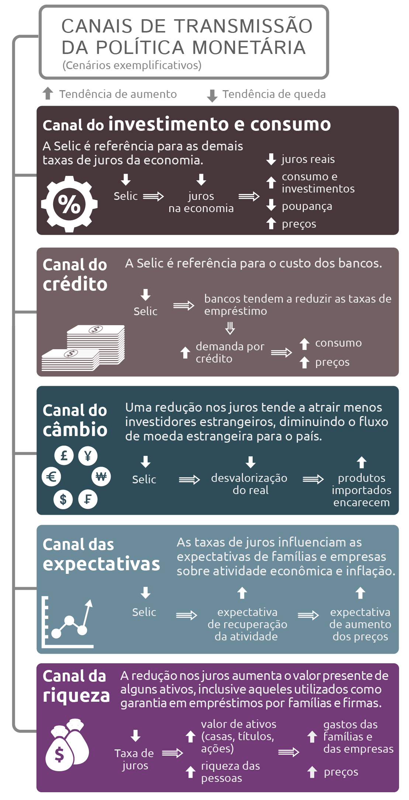

```{r mba0, include=FALSE}
setwd('/Users/jricardofl/Dropbox/tempecon/facape/mba2023')
#setwd("C:/Users/User client/Dropbox/tempecon/Facape/mba2023")

knitr::opts_chunk$set(
  echo       = TRUE,
  warning    = FALSE,
  message    = FALSE,
  comment    = NA,
  fig.width  = 10, 
  fig.height = 6,
  fig.align  = "center",
  comment    = "#",
  size       = "normalsize"
  )
```

<br>

# A Política Monetária

<br>

Como visto, toda vez que a oferta de meios de pagamento cresce acima do PIB, há um aumento na taxa de crescimento do nível geral de preços. Foi visto também que agentes econômicos descentralizados, dotados de alguma racionalidade e necessidades ilimitadas, escolhem diariamente o uso de recursos escassos entre fins alternativos. Tais decisões são facilitadas com o uso do que conhecemos por **moeda**. A moeda é definida pelas suas funções, que são: (i) servir de meio de troca; (ii) unidade de conta; (iii) reserva de valor.

Em termos contemporâneos, a **moeda** de uma economia consiste na totalidade de ativos possuídos pelo público que pode ser utilizada a qualquer momento para a liquidação de qualquer compromisso futuro ou à vista. 

Ao considerar a **moeda** de uma economia como um todo, devemos fazer uso do conceito de *agregados monetários*. Para chegar a eles, vamos considerar a emissão de 100 unidades monetárias por um Banco Central qualquer. A partir disso, segue que:

* PME = Papel Moeda Emitido - 100

* Retenção pelo Banco Central - (20)

* PMC = Papel Moeda em Circulação - 80

* Em poder dos Bancos Comerciais (BCs) - (25)

* PMPP = Papel Moeda em Poder do Público - 55

* DVBC = Depósito à Vista nos BCs - 50

* M1 = Meios de Pagamento - 105


O chamado M1, nesse contexto, a soma entre depósitos à vista nos bancos comerciais com o papel moeda em poder do público, será o agregado monetário principal. Nele, por suposto, já há uma interessante função do sistema bancário: o de servir também como criador de moeda. Isto porque, dada uma quantidade de reservas próprias disponíveis nos bancos comerciais, apenas uma pequena parte dela sera utilizada para fazer frente à necessidade de papel moeda dos agentes. Desse modo, os bancos comerciais podem literalmente multiplicar essas reservas, fornecendo empréstimos a outros agentes, mas registrando esses empréstimos como depósitos à vista. Assim, o M1 será sempre maior do que o papel inicialmente emitido pelo Banco Central. 

A partir do M1 são construídos os demais agregados monetários, com base em depósitos a prazo, títulos privados e títulos públicos. Abaixo um resumo:

* Base Monetária = PMPP + Reservas Bancárias

* M1 = PMPP + DVBC

* M2 = M1 + Depósitos a Prazo + Títulos Públicos Federais

* M3 = M2 + Depósitos de Poupança

* M4 = M3 + Títulos Privados

Os agregados monetários são importantes para definir a capacidade de demanda dos agentes por bens e serviços. Para tal, é fundamental destacar o conceito de liquidez:

* **de um ativo** = é a capacidade de se converter em moeda no curto prazo sem perda;

* **da economia** = é a relação entre a disponibilidade de moeda e a necessidade das transações mercantis e financeiras do país.

Quanto mais organizado, portanto, for o sistema financeiro de um país, mais rápido e com a menor perda possível será possível converter um depósito a prazo ou título de renda fixa, por exemplo, em moeda, para liquidar obrigações. 

<br>

### O Banco Central e a operacionalização da política monetária

<br>

O Banco Central é a autoridade incubida de garantir a liquidez da economia, isto é, manter razoavelmente estável a relação entre disponibilidade de moeda e a necessidade das transações mercantis e financeiras do país. Em termos um pouco mais gerais, cabe aos Bancos Centrais:

* Servir de emissor de papel moeda e controlador de liquidez;

* Ser o Banqueiro dos Bancos (emprestador de última instância);

* Regular o Sistema Monetário e Financeiro;

* Ser o Depositário de reservas internacionais.

Para isso, o Banco Central dispõe de alguns instrumentos, entre os quais as operações de mercado aberto, os depósitos compulsórios e a taxa de redesconto. No primeiro são processadas operações de compra e venda de títulos públicos, com o intuito de marcar posição no **mercado de reservas bancárias**, definindo assim a taxa de juros de curto prazo. Com o segundo, o Banco Central interfe diretamente nas reservas dos bancos comerciais, disponibilizando mais ou menos recursos para que os mesmos possam fazer suas operações regulares. Por fim, com as taxas de redesconto, o Banco Central pune aquelas instituições que precisam de recursos para honrar seus compromissados em determinado período do tempo. 

<br>

#### O Comitê de Política Monetária (COPOM)

<br>

O Comitê de Política Monetária do Banco Central é o responsável por definir a meta a ser perseguida para a taxa básica de juros no país. Instituído em 20 de junho de 1996, reune-se periodicamente para avaliar o comportamento da liquidez da economia e a estabilidade do sistema financeiro. 

Desde a publicação do decreto 3.088, de 21 de junho de 1999, o COPOM segue - ou deveria seguir - a sistemática instituída pelo regime de metas para inflação. Neste, o Banco Central calibra a taxa básica de juros em função do que ocorre com a taxa de crescimento do nível geral de preços. Assim, pressões inflacionárias devem ser combatidas com aumentos de taxa de juros e deflações, com reduções. 

<br>

#### O mercado de reservas bancárias

<br>

Destina-se à negociação das reservas bancárias entre os bancos, e entre estes e o Banco Central. É o espaço institucional onde o Banco Central executa a Política Monetária. É dividido em:

* Mercado Primário: Banco Central e Bancos Comerciais, onde ocorre criação (vende títulos) ou destruição de moeda (compra títulos);
  
* Mercado Secundário: Onde ocorrem transações interbancárias, que resultam em uma permuta de reservas entre os bancos.

Assim como pessoas físicas mantêm depósitos à vista, os bancos também possuem contas correntes no Banco Central, através das quais recebem débitos e créditos das demais instituições financeiras, do Tesouro Nacional e do próprio Banco Central. Em outras palavras, é por este tipo de conta que bancos realizam operações entre si e com o BACEN. A cada dia, haverá um conjunto de bancos que possui um saldo líquido das entradas e saídas positivo e outro grupo que apresenta saldo negativo. A priori, os saldos positivos e negativos dos bancos são zerados de modo natural através de transações interbancárias. 

O Banco Central atua diariamente no mercado de reservas de modo a acomodar a demanda dos bancos, matendo assim estável a **taxa básica de juros**. Para isso, ele realiza uma previsão dos fatores que levam a uma variação autônoma de reservas para guiar suas ações neutralizadoras e compensadoras diante dos movimentos das reservas, seja injetando ou retirando liquidez do mercado. O pressuposto é de que existe um nível de reservas bancárias que garante a estabilidade da taxa de juros e é este nível que deve ser perseguido pelas ações compensatórias.

Cabe ao Banco Central também sinalizar para o mercado os rumos da política monetária, buscando influenciar a **estrutura a termo da taxa de juros** da economia por meio da variável operacional básica, a taxa de juros de curto prazo. Isto porque, essa taxa é específica ao mercado de reservas bancárias. As taxas que de fato importam para consumidores e investidores são aquelas de mais longo prazo. Dessa forma, uma correta sinalização do que irá ocorrer com a taxa de curto prazo irá repercutir pelas taxas de diferentes prazos, influenciando assim decisões de consumo e investimento, de acordo com os planos iniciais da autoridade monetária. 

<br>

#### O Sistema Especial de Liquidação e Custódia (SELIC)

<br>

O Sistema Especial de Liquidação e Custódia (SELIC) opera com títulos públicos do Banco Central e do Tesouro Nacional. É um grande computador que tem por finalidade controlar e liquidar financeiramente as operações de compra e de venda de títulos públicos e manter sua custódia física e escritural. Os vários negócios com esses títulos são acertados diretamente entre os operadores das instituições financeiras credenciadas a operar no mercado monetário, que repassam as informações, via terminal, ao SELIC, para que ocorra a transferência do dinheiro e, a seguir, dos títulos. 

A **Taxa Selic** é definida como "a taxa média ajustada dos financiamentos diários apurados no Sistema Especial de Liquidação e de Custódia (Selic) para títulos federais. Para fins de cálculo da taxa, são considerados os financiamentos diários relativos às operações registradas e liquidadas no próprio Selic e em sistemas operados por câmaras ou prestadores de serviços de compensação e de liquidação".

<br>

#### Controle de Liquidez

<br>

Ajustes compensatórios feitos através do *departamento de Open Market* do BACEN:

* **Operações Compromissadas** - consistem na compra e venda de títulos públicos em que o vendedor se compromete a recomprar o título a um preço acordado e em uma data especificada do comprador;
  
* **Leilões informais** - podem ser tanto de títulos quanto de dinheiro, sendo este mais frequente. Nos leilões de dinheiro, o BACEN oferta dinheiro exigindo como garantia títulos, comprometendo-se a instituição a recomprar o título normalmente no day after. Já nos leilões de título, as operações são definitivas, isto é, o BACEN vende títulos e não há garantia de recompra futura. 
  
* **Leilões Formais** - caracterizam-se por serem anunciados com antecedência se comparado aos informais, bem como por serem sempre operações definitivas e também serem sempre operações de venda de papéis.

<br>

#### A formação da taxa básica de juros no Brasil

<br>

A taxa de juros fixada na reunião do COPOM é a meta para a Taxa Selic (taxa média dos financiamentos diários, com lastro em títulos federais, apurados no **Sistema Especial de Liquidação e Custódia**), a qual vigora por todo o período entre reuniões ordinárias do Comitê.

A taxa de juros de curto prazo, a taxa básica da economia, representa o custo do dinheiro no curto prazo. Isto é, o custo incorrido pelos bancos ao demandar reservas ao BACEN. Ela será dada, assim, pelo confronto entre **oferta de reservas**, definida pelas atuações do Banco Central nas operações compromissadas e definitivas e o saldo do fluxo de entrada e saída de dinheiro para e do sistema bancário, com a demanda por reservas dessas instituições, definida pelas suas necessidades de atender as exibilidades compulsórias e seus compromissos com o setor não monetário da economia. 

O Banco Central atua sinalizando para as instituições quais serão as condições vigentes no mercado de reservas de acordo com uma meta para a taxa de juros de curto prazo (meta operacional), a partir do fato de que o Banco Central é um ofertante monopolista no mercado de reservas.

Como dito anteriormente, apesar de ser monopolista, o Banco Central tem que levar em conta os desejos e expectativas dos bancos. Isto porque:

* A determinação dos juros não pode ser feita sem considerar a solvência dos bancos (agravar as condições de liquidez);
  
* Suas operações têm base na persuação (os bancos quando tomam decisões de compra de títulos estão apoiados em uma expectativa quanto à evolução futura da taxa básica).

Uma vez definida a taxa básica de juros, ela se propaga pelo organismo econômico por meio de diferentes canais, como pode ser visto abaixo, até afetar a taxa de crescimento do nível geral de preços.

<br>

{width="75%"} 

<br>

{width="100%"} 

<br>

### A condução da política monetária

<br>

Como dito, a política monetária é expansionista ou contracionista se, respectivamente, o juro real estiver abaixo ou acima da taxa de juros neutra. Taxa de juros neutra é aquela consistente com a estabilidade da taxa de inflação ao longo do tempo. Variável não observável, que deve ser estimada e que depende de diversos fatores. Nesses termos, cabe ao Banco Central manter a taxa de juros real próxima da taxa de juros neutra, se o objetivo é controlar a inflação.

Pela **equação de Fisher**, sabe-se que 

$$
i = r + \pi
\tag{1}
$$
onde, $i$ é a taxa de juros nominal, $r$ é a taxa de juros real e $\pi$ é a taxa de inflação. Rearranjando os termos, define-se o juro real **ex-post** como:

$$
r = i - \pi
\tag{2}
$$
Para tornar a análise **ex-ante**, deve-se substituir $\pi$ pela expectativa de inflação, isto é, $\pi^{e}$, de modo que o juro real **ex-ante** será dado por:

$$
r = i - \pi^{e}
\tag{3}
$$

Em outras palavras, o juro real \emph{ex-ante} será dado, de forma aproximada, pela **diferença entre o juro nominal e a expectativa de inflação**. Essa é, em geral, a forma como o mercado calcula a taxa de juros real no país.

<br>

{width="100%"} 

<br>

``` {r mba1, fig.cap = 'Figura 4: Expectativas de Inflação e Taxa de juros Selic'}

# Pacotes
library(sidrar)
library(GetTDData)
library(readr)
library(xts)
library(forecast)
library(scales)
library(ggplot2)
library(mFilter)
library(grid)
library(png)
library(rbcb)
library(Quandl)
library(tidyverse)
library(plotly)
library(BMR)
library(plotly)
library(GetBCBData)
library(easyGgplot2)

#dados_sgs <- GetBCBData::gbcbd_get_series(
#id = c("Selic" = 4189),
#first.date = "2012-06-01",
#last.date = "2023-02-01",
#format.data = "wide"
#)
#tail(dados_sgs)

#write.csv2(dados_sgs, file='arquivo26.csv')

selic <- ts(read.csv2('arquivo26.csv',
                       header=T, sep=';', dec=',')[,-c(1,2)],
             start=c(2012,06), freq=12)
 
## Expectativa de Inflação 12 meses à frente
#expinf <- get_twelve_months_inflation_expectations('IPCA',
#start_date = '2012-06-01')

load("expinf12.RData")

expectativa <- apply.monthly(expinf12, mean)

g1 <- autoplot(selic)+
geom_line(colour="darkblue", size=1.5)+
xlab('')+ylab('% a.a.')+
ggtitle('Taxa de juros - Selic acumulada no mês anualizada')

g2 <- autoplot(expectativa)+
geom_line(colour="darkgreen", size=1.5)+
xlab('')+ylab('% a.a.')+
ggtitle('Expectativas de Inflação - 12 meses')

ggplot2.multiplot(g2, g1, cols=2)
```

<br>
